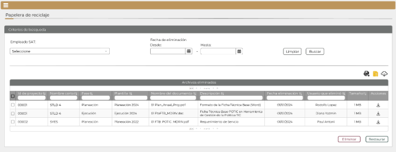

||Administración General de Comunicaciones y Tecnologías de la Información|
| :- | -: |
||Marco Documental 7.0|
|Fecha de aprobación del Template: 02/08/2023|
**Especificación de Interacción de Usuario**

17\_3083\_EIU\_ConsultarPapeleradeReciclaje.docx
|Versión del template: 7.00|
| :-: | :-: | :-: |

**<ID Requerimiento>** 8309

**Nombre del Requerimiento:** TI\_SISECOFI-SAT\_Seguimiento financiero y control documental de proyectos de contratación.
## **Tabla de Versiones y Modificaciones**

|Versión|Descripción del cambio|Responsable de la Versión|Fecha|
| :- | :- | :-: | :-: |
|*1*|*Creación del documento*|Angel Horacio López Alcaraz|*09/07/2024*|
|*1.1*|*Revisión del documento*|Rodolfo López Meneses|*17/07/2024*|
|*1.2*|*Versión aprobada para firma*|
María del Carmen Castillejos Cárdenas

Rubén Delgado Ramírez
|*19/07/2024*|

**TABLA DE CONTENIDO**

[Tabla de Versiones y Modificaciones	1](#_toc171608339)

[Módulo: PAPELERA DE RECICLAJE	2](#_toc171608340)

[ESTILOS 01	2](#_toc171608341)

[Descripción de Elementos	3](#_toc171608342)

[Descripción de Campos	4](#_toc171608343)

[ESTILOS 02	11](#_toc171608344)

[Descripción de Elementos	12](#_toc171608345)

[Descripción de Campos	12](#_toc171608346)

[ESTILOS 03	14](#_toc171608347)

[Descripción de Elementos	15](#_toc171608348)

[Descripción de Campos	15](#_toc171608349)

## **MÓDULO: PAPELERA DE RECICLAJE**
## **ESTILOS 01**

|**Nombre de la Pantalla:** |Papelera de reciclaje|
| :- | :- |
|**Objetivo:**|
Permitir al Empleado SAT que cuente con los roles necesarios, recuperar documentos eliminados, así como eliminar de forma permanente aquellos que no sean requeridos. 

|
|**Casos de uso relacionados:**|
17\_3083\_ECU\_ConsultarPapeleradeReciclaje

|
|||
|||

### **DESCRIPCIÓN DE ELEMENTOS** 

|**Elemento**|**Descripción**|
| :- | :- |
|![ref1]|Opción que al seleccionarla muestra el menú principal desplegado en la parte izquierda de la pantalla; contiene los módulos principales y submódulos de este sistema.|
|Papelera de reciclaje|Título del encabezado.|
|Criterios de búsqueda|Título del encabezado que identifica a la sección.|
|Empleado SAT:|Campo que permite seleccionar el nombre del Empleado SAT para realizar la búsqueda de documentos.|
|Fecha de eliminación Desde:|Opción que permite seleccionar o ingresar una fecha de inicio para la búsqueda.|
|Fecha de eliminación Hasta:|Opción que permite seleccionar o ingresar una fecha de fin para la búsqueda.|
|Limpiar|Opción que permite limpiar los criterios de búsqueda ingresados.|
|Buscar|Opción que permite iniciar la búsqueda en la base de datos (BD) de la información de acuerdo con los criterios ingresados.|
|![ref2]|Opción que permite exportar la información de los documentos seleccionados de la tabla “Archivos eliminados”, generando un archivo de Excel con extensión (.xlsx).|
|![ref3]|Opción que permite la descarga masiva. Esta opción indica que se exportarán los documentos seleccionados en una carpeta comprimida (.ZIP).|
|![ref4]|Opción que permite la descarga de los documentos seleccionados mediante el componente SATCloud.|
|Archivos eliminados|Nombre del encabezado de la tabla.|
||Paginador que permite navegar a través de las páginas resultantes de la consulta considerando que el sistema debe mostrar inicialmente 15 registros por página, permitiendo visualizar entre 15, 50 y 100 registros por página.|
|![ref5]|Opción que permite seleccionar uno, o todos los documentos de la tabla para realizar las acciones deseadas.|
|Id de proyecto|Campo que muestra el Id del proyecto.|
|Nombre corto|Campo que muestra el nombre corto del proyecto.|
|Fase|Campo que muestra la fase del proyecto.|
|Plantilla|Campo que muestra la plantilla perteneciente al documento.|
|Nombre del documento|Campo que muestra el nombre del documento.|
|Descripción|Campo que muestra la descripción perteneciente al documento.|
|Fecha eliminación|Campo que muestra la fecha de eliminación del documento.|
|Usuario que eliminó|Campo que muestra el nombre del Empleado SAT que eliminó el documento.|
|Tamaño|Campo que muestra el tamaño del documento.|
|Acciones|Nombre de la columna que muestra las acciones que se pueden realizar.|
|![ref6]|Opción que permite la descarga del documento seleccionado.|
|![ref7]|Opción que ordena la información de la tabla de forma ascendente o descendente y de forma alfabética, según aplique.|
|![ref8]|Campo para filtrar información de la columna en la que se requiere buscar específicamente.|
|![ref9]|Permite desplazarse de manera horizontal en la tabla.|
|![ref10]|Permite desplazarse de manera vertical en la tabla.|
|Eliminar|Opción que permite eliminar de forma permanente los documentos seleccionados.|
|Restaurar|Opción que permite restaurar los documentos seleccionados, regresándolos a su ubicación original.|

### **DESCRIPCIÓN DE CAMPOS**

|**Elemento**|**Tipo**|**Longitud**|
**Nivel de Acceso**

**(L, E, S)**
|**Descripción del Campo**|**Fórmulas**|**Precisiones**|
| :-: | :-: | :-: | :-: | :-: | :-: | :-: |
|![ref1]|Ícono|N/A|S|Muestra el menú principal desplegado en la parte izquierda de la pantalla.|N/A|N/A|
|Papelera de reciclaje|Texto|N/A|L|Título del encabezado.|N/A|Para el encabezado puede hacerse uso de mayúsculas y minúsculas.|
|Criterios de búsqueda|Texto|N/A|L|Título del encabezado que identifica a la sección.|N/A|N/A|
|Empleado SAT:|Lista de selección|N/A|S|Campo que permite seleccionar el nombre del Empleado SAT para realizar la búsqueda de documentos.|N/A|N/A|
|Fecha de eliminación Desde:|Fecha|10|L, E, S|Opción que permite seleccionar o ingresar una fecha de inicio para la búsqueda.|N/A|Formato de fecha DD/MM/AAAA.|
|Fecha de eliminación Hasta:|Fecha|10|L, E, S|Opción que permite seleccionar o ingresar una fecha de fin para la búsqueda.|N/A|Formato de fecha DD/MM/AAAA.|
|Limpiar|Botón|N/A|S|Opción que permite limpiar los criterios de búsqueda ingresados.|N/A|
Inicialmente se muestra sin color de fondo y con contorno y letras en color gris.

Cuando se pone el cursor encima debe cambiar a fondo gris y letras negras. 
|
|Buscar|Botón|N/A|S|Opción que permite iniciar la búsqueda en la BD de la información de acuerdo con los criterios ingresados.|N/A|
Inicialmente se muestra sin color de fondo y con contorno y letras en color gris.  

Cuando se pone el cursor encima debe cambiar a fondo gris y letras negras.
|
|![ref2]|Ícono|N/A|S|Opción que permite exportar la información de los documentos seleccionados de la tabla “Archivos eliminados”, generando un archivo de Excel con extensión (.xlsx).|N/A|
Se genera una fila por cada documento y que se repita el resto de la información.

Usar *tooltip* que muestre el nombre de la opción “Exportar documentos”.
|
|![ref3]|Ícono|N/A|S|Opción que permite la descarga masiva. Esta opción indica que se exportarán los documentos seleccionados en una carpeta comprimida (.ZIP).|N/A|Usar *tooltip* que muestre el nombre de la opción “Descargar ZIP”.|
|![ref4]|Ícono|N/A|S|Opción que permite la descarga de los documentos seleccionados mediante el componente SATCloud.|N/A|Usar *tooltip* que muestre el nombre de la opción “SATCloud”.|
|Archivos eliminados|Texto|N/A|L|Nombre del encabezado de la tabla.|N/A|N/A|
||Paginador|N/A|S|Paginador que permite navegar a través de las páginas resultantes de la consulta.|N/A|Inicialmente se deben mostrar 15 registros por página, permitiendo visualizar entre 15, 50 y 100 registros por página.|
|![ref5]|Casilla de selección|N/A|S|Opción que permite seleccionar uno, o todos los documentos de la tabla para realizar las acciones deseadas.|N/A|N/A|
|Id de proyecto|Numérico|5|L|Campo que muestra el Id del proyecto.|N/A|
Ejemplo:

00001
|
|Nombre corto|Alfanumérico|N/A|L|Campo que muestra el nombre corto del proyecto.|N/A|
Ejemplo:

STLD 4
|
|Fase|Alfanumérico|N/A|L|Campo que muestra la fase del proyecto.|N/A|N/A|
|Plantilla|Alfanumérico|N/A|L|Campo que muestra la plantilla perteneciente al documento.|N/A|N/A|
|Nombre del documento|Alfanumérico|N/A|L|Campo que muestra el nombre del documento.|N/A|N/A|
|Descripción|Texto|N/A|L|Campo que muestra la descripción perteneciente al documento.|N/A|N/A|
|Fecha eliminación|Fecha|10|L|Campo que muestra la fecha de eliminación del documento.|N/A|Formato de fecha DD/MM/AAAA.|
|Usuario que eliminó|Alfanumérico|N/A|L|Campo que muestra el nombre del Empleado SAT que eliminó el documento.|N/A|N/A|
|Tamaño|Alfanumérico|N/A|L|Campo que muestra el tamaño del documento.|N/A|
Ejemplo:

4 MB
|
|Acciones|Texto|N/A|L|Nombre de la columna que muestra las acciones que se pueden realizar.|N/A|N/A|
|![ref6]|Ícono|N/A|S|Opción que permite la descarga del documento seleccionado.|N/A|Usar *tooltip* que muestre el nombre de la opción “Descargar documento”.|
|![ref7]|Ícono|N/A|S|Opción que ordena la información de la tabla de forma ascendente o descendente y de forma alfabética, según aplique.|N/A|N/A|
|![ref8]|Filtro|N/A|E|Campo para filtrar información de la columna en la que se requiere buscar específicamente.|N/A|Realiza el filtro de la información solo dentro de la página que se visualiza.|
|![ref9]|Barra de desplazamiento|N/A |S|Permite desplazarse de manera horizontal en la tabla.|N/A|N/A|
|![ref10]|Barra de desplazamiento|N/A |S|Permite desplazarse de manera vertical en la tabla.|N/A|N/A|
|Eliminar|Botón|N/A|S|Opción que permite eliminar de forma permanente los documentos seleccionados.|N/A|
Inicialmente se muestra sin color de fondo y con el texto y contorno en color guinda (#691c32).

Cuando se le pone el cursor encima debe cambiar a fondo guinda (#691c32) y letras blancas.
|
|Restaurar|Botón|N/A|S|Opción que permite restaurar los documentos seleccionados, regresándolos a su ubicación original.|N/A|
Inicialmente se muestra sin color de fondo y con el texto y contorno en color verde oscuro (#10312B).

Cuando se le pone el cursor encima debe cambiar con fondo verde oscuro (#10312B) y letras blancas.
|

##
## **ESTILOS 02**

|**Nombre de la Pantalla:** |
Datos de la descarga

|
| :- | :- |
|**Objetivo:**|
Ventana que muestra el enlace y contraseña para la descarga en SATCloud.

|
|**Casos de uso relacionados:**|17\_3083\_ECU\_ConsultarPapeleradeReciclaje|
|

||

### **DESCRIPCIÓN DE ELEMENTOS** 

|**Elemento**|**Descripción**|
| :- | :- |
|Datos de la descarga|Título de la ventana.|
|![ref11]|Opción que permite cerrar la ventana emergente.|
|url:|Campo que muestra la url de descarga de SATCloud.|
|contraseña:|Campo que muestra la contraseña para descarga del archivo en SATCloud.|
|![ref12]|Opción que permite copiar la contraseña asignada.|
|Cerrar|Opción que permite cerrar la ventana emergente.|

### **DESCRIPCIÓN DE CAMPOS**
###
|**Elemento**|**Tipo**|**Longitud**|
**Nivel de Acceso**

**(L, E, S)**
|**Descripción del Campo**|**Fórmulas**|**Precisiones**|
| :-: | :-: | :-: | :-: | :-: | :-: | :-: |
|Datos de la descarga|Texto|N/A|L|Título de la ventana.|N/A|N/A|
|![ref13]|Ícono|N/A|S|Opción que permite cerrar la ventana emergente.|N/A|Usar *tooltip* que muestre el nombre de la opción “Cerrar ventana”.|
|URL:|Texto|N/A|S|Campo que muestra la URL de descarga de SATCloud.|N/A|N/A|
|contraseña:|Texto|N/A|L|Campo que muestra la contraseña para descarga del archivo en SATCloud.|N/A|N/A|
|![ref14]|Ícono|N/A|S|Opción que permite copiar la contraseña.|N/A|N/A|
|Cerrar|Botón|N/A|S|Opción que permite cerrar la ventana emergente.|N/A|
Inicialmente se muestra sin color de fondo y con el texto y contorno en color guinda (#691c32).

Cuando se le pone el cursor encima debe cambiar a fondo guinda (#691c32) y letras blancas.
|

## **ESTILOS 03**

|**Nombre de la Pantalla:** |
Procesando información

|
| :- | :- |
|**Objetivo:**|
Mostrar el avance porcentual del proceso de consulta realizado.

|
|**Casos de uso relacionados:**|17\_3083\_ECU\_ConsultarPapeleradeReciclaje|

### **DESCRIPCIÓN DE ELEMENTOS** 

|**Elemento**|**Descripción**|
| :- | :- |
|![Forma

Descripción generada automáticamente con confianza baja]|Opción que muestra el avance porcentual del proceso ejecutado.|
|Procesando…|Mensaje informativo que indica que el proceso se está ejecutando.|

### **DESCRIPCIÓN DE CAMPOS**

|**Elemento**|**Tipo**|**Longitud**|
**Nivel de Acceso**

**(L, E, S)**
|**Descripción del Campo**|**Fórmulas**|**Precisiones**|
| :-: | :-: | :-: | :-: | :-: | :-: | :-: |
|![Forma

Descripción generada automáticamente con confianza baja]|Ícono|N/A|L|Opción que muestra el avance porcentual del proceso ejecutado.|N/A|N/A.|
|Procesando…|Texto|N/A|L|Mensaje informativo que indica que el proceso se está ejecutando.|N/A|N/A|

Anexo - Ejemplos de botones

Las acciones de cada botón se definen en los estilos correspondientes.

||
| :- |

|**FIRMAS DE CONFORMIDAD** ||
| :-: | :- |
|**Firma 1**  |**Firma 2**  |
|**Nombre**: Diana Yazmín Pérez Sabido.|**Nombre**: Rodolfo López Meneses. |
|**Puesto**: Usuaria ACPPI.|**Puesto**: Usuario ACPPI.|
|**Fecha:** |**Fecha:** |
|  |  |
|**Firma 3**  |**Firma 4** |
|**Nombre**: Rubén Delgado Ramírez. |**Nombre**: María del Carmen Castillejos Cárdenas. |
|**Puesto**: Usuario ACPPI. |**Puesto**: APE ACPPI. |
|**Fecha:** |**Fecha:** |
|  |  |
|**Firma 5** |**Firma 6** |
|**Nombre**: Alejandro Alfredo Muñoz Núñez. |**Nombre**: Erick Villa Beltrán. |
|**Puesto**: RAPE ACPPI. |**Puesto**: Líder APE SDMA 6. |
|**Fecha**: |**Fecha**: |
|  |  |
|**Firma 7**|**Firma 8**|
|**Nombre**: Juan Carlos Ayuso Bautista. |**Nombre**: Angel Horacio López Alcaraz. |
|**Puesto**: Líder Técnico SDMA 6. |**Puesto**: Analista de Sistemas SDMA 6.|
|**Fecha**: |**Fecha**: |
|||

||
| :- |

|||Página 10 de 64|
| :- | :-: | -: |

[ref1]: Aspose.Words.2f252f4d-31e1-43ab-8e3b-4f5a0966ba64.003.png
[ref2]: Aspose.Words.2f252f4d-31e1-43ab-8e3b-4f5a0966ba64.004.png
[ref3]: Aspose.Words.2f252f4d-31e1-43ab-8e3b-4f5a0966ba64.005.png
[ref4]: Aspose.Words.2f252f4d-31e1-43ab-8e3b-4f5a0966ba64.006.png
[ref5]: Aspose.Words.2f252f4d-31e1-43ab-8e3b-4f5a0966ba64.008.png
[ref6]: Aspose.Words.2f252f4d-31e1-43ab-8e3b-4f5a0966ba64.009.png
[ref7]: Aspose.Words.2f252f4d-31e1-43ab-8e3b-4f5a0966ba64.010.png
[ref8]: Aspose.Words.2f252f4d-31e1-43ab-8e3b-4f5a0966ba64.011.png
[ref9]: Aspose.Words.2f252f4d-31e1-43ab-8e3b-4f5a0966ba64.012.png
[ref10]: Aspose.Words.2f252f4d-31e1-43ab-8e3b-4f5a0966ba64.013.png
[ref11]: Aspose.Words.2f252f4d-31e1-43ab-8e3b-4f5a0966ba64.016.png
[ref12]: Aspose.Words.2f252f4d-31e1-43ab-8e3b-4f5a0966ba64.017.png
[ref13]: Aspose.Words.2f252f4d-31e1-43ab-8e3b-4f5a0966ba64.018.png
[ref14]: Aspose.Words.2f252f4d-31e1-43ab-8e3b-4f5a0966ba64.019.png
[Forma

Descripción generada automáticamente con confianza baja]: Aspose.Words.2f252f4d-31e1-43ab-8e3b-4f5a0966ba64.021.png
