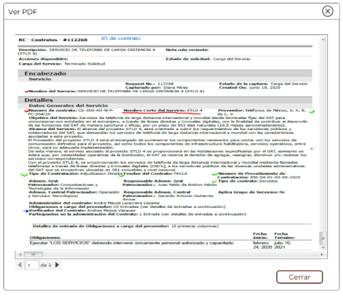
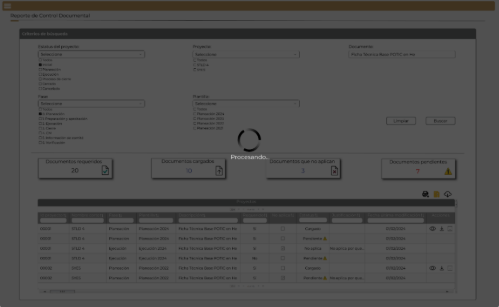

||Administración General de Comunicaciones y Tecnologías de la Información|
| :- | -: |
||Marco Documental 7.0|
|Fecha de aprobación del Template: 02/08/2023|
**Especificación de Interacción de Usuario**

17\_3083\_EIU\_ConsultarReporteDeControlDocumental.docx
|Versión del template: 7.00|
| :-: | :-: | :-: |

**<ID Requerimiento>** 8309

**Nombre del Requerimiento:** TI\_SISECOFI-SAT\_Seguimiento financiero y control documental de proyectos de contratación

## **Tabla de Versiones y Modificaciones**

|Versión|Descripción del cambio|Responsable de la Versión|Fecha|
| :-: | :- | :- | :-: |
|*1*|*Creación del documento*|Eduardo Acosta Mora|*10/07/2024*|
|*1.1*|*Revisión del documento*|Diana Yazmín Pérez Sabido|*18/07/2024*|
|*1.2*|*Versión aprobada para firma*|
María del Carmen Castillejos Cárdenas

Rubén Delgado Ramírez
|*18/07/2024*|

**TABLA DE CONTENIDO**

[Tabla de Versiones y Modificaciones	1](#_toc172197492)

[Módulo: REPORTE DE CONTROL DOCUMENTAL	2](#_toc172197493)

[ESTILOS 01	2](#_toc172197494)

[Descripción de Elementos	3](#_toc172197495)

[Descripción de Campos	5](#_toc172197496)

[ESTILOS 02	13](#_toc172197497)

[Descripción de Elementos	14](#_toc172197498)

[Descripción de Campos	14](#_toc172197499)

[ESTILOS 03	16](#_toc172197500)

[Descripción de Elementos	17](#_toc172197501)

[Descripción de Campos	17](#_toc172197502)

[ESTILOS 04	19](#_toc172197503)

[Descripción de Elementos	20](#_toc172197504)

[Descripción de Campos	20](#_toc172197505)

## **MÓDULO: REPORTE DE CONTROL DOCUMENTAL**
## **ESTILOS 01**

|**Nombre de la Pantalla:**|Reporte de Control Documental|
| :- | :- |
|**Objetivo:**|
Permite al Empleado SAT consultar la documentación relacionada con el proyecto, incluyendo sus contratos y/o convenios modificatorios, dictámenes y facturas relacionados durante la vida del proyecto.

|
|**Casos de uso relacionados:**|17\_3083\_EIU\_ConsultarReporteDeControlDocumental|
|||

### **DESCRIPCIÓN DE ELEMENTOS** 

|**Elemento**|**Descripción**|
| :- | :- |
|![ref1]|Opción que al seleccionarla muestra el menú principal desplegado en la parte izquierda de la pantalla; contiene los módulos principales y submódulos de este sistema.|
|Reporte de Control Documental|Título del encabezado que identifica el submódulo a donde se está ingresando.|
|Criterios de búsqueda|Sección donde se muestran los criterios de búsqueda.|
|Estatus del proyecto:|Campo que permite seleccionar el o los estatus del proyecto.|
|Proyecto:|Campo que permite seleccionar uno o más proyectos.|
|Documento:|Campo que permite ingresar el nombre del archivo a buscar.|
|Fase:|Campo que permite seleccionar una o más fases de la matriz documental. |
|Plantilla:|Campo que permite seleccionar una o más plantillas correspondientes a la fase seleccionada.|
|Limpiar|Opción que permite restaurar los filtros de búsqueda a sus valores predeterminados.|
|Buscar|Opción que permite iniciar la búsqueda de información en la base de datos (BD) de acuerdo con lo seleccionado e ingresado en los filtros de búsqueda.|
|Documentos requeridos ![ref2]|Indica la cantidad de documentos que son requeridos en la matriz documental de acuerdo con el resultado de la búsqueda.|
|
Documentos cargados

![ref3]
|Indica la cantidad de documentos que se hayan adjuntado en la gestión documental de acuerdo con el resultado de la búsqueda.|
|
Documentos que no aplican

![ref4]
|Indica la cantidad de documentos que no apliquen en la gestión documental de acuerdo con el resultado de la búsqueda.|
|
Documentos pendientes

![ref5]
|Indica la cantidad de documentos que aún no se han adjuntado en la gestión documental de acuerdo con el resultado de la búsqueda.|
|![ref6]|Opción que permite exportar la información de la BD de acuerdo con el resultado de la búsqueda, generando un archivo de Excel con extensión (.xlsx).|
|![ref7]|Opción que permite la descarga masiva. Esta opción indica que se exportarán todos los documentos en una carpeta comprimida (.ZIP).|
|![ref8]|Opción que permite descargar los documentos adjuntos al proyecto, incluyendo sus contratos y/o convenios modificatorios, dictámenes y facturas relacionadas mediante el componente SATCloud.|
|Proyectos|Título de la tabla.|
|![ref9]|Paginador que permite navegar a través de las páginas resultantes de la consulta, considerando que el sistema debe mostrar inicialmente 15 registros por página, permitiendo elegir visualizar 15, 50 y 100 registros por página.|
|![ref10]|Campo que permite filtrar la información de la columna en la que se requiere buscar específicamente.|
|![ref11]|Opción que ordena la información de la tabla de forma ascendente o descendente y de forma alfabética, según aplique.|
|Id proyecto|Indica el Id de proyecto al cual pertenece el documento.|
|Nombre corto|Indica el nombre corto del proyecto al cual pertenece el documento. |
|Fase|Indica la fase a la cual pertenece el documento.|
|Plantilla|Indica la plantilla a la cual pertenece el documento.|
|Descripción|Indica la descripción del documento solicitado en la matriz documental.|
|Requerido|Indica si un documento es obligatorio mostrando “Sí” o “No”.|
|No aplica|
Indica si un documento aplica para el proyecto, contrato, convenio modificatorio, dictamen o factura relacionada de acuerdo con las siguientes opciones sin opción a editar:

![ref12] No

![ref13] Sí
|
|Estatus|
Indica el estatus de un documento de acuerdo con lo siguiente:

- Cargado

- Pendiente ![ref14]

- No aplica
|
|Justificación|Indica la justificación para el documento en caso de que su estatus sea “No aplica”.|
|Fecha última modificación|Indica la fecha de última modificación del registro.|
|Acciones|Acciones que se pueden realizar para cada resultado de la búsqueda.|
|![ref15]|Opción que permite visualizar el documento seleccionado en una ventana emergente.|
|![ref16]|Opción que permite descargar el documento seleccionado.|
|![ref17]|Opción que muestra la pantalla de gestión documental de un proyecto, contrato, convenio modificatorio o dictamen de acuerdo con su fase.|
|![ref18]|Permite desplazarse de manera horizontal en la tabla. |
|![ref19]|Permite desplazarse de manera vertical en la tabla. |

### **DESCRIPCIÓN DE CAMPOS**

|**Elemento**|**Tipo**|**Longitud**|
**Nivel de Acceso**

**(L, E, S)**
|**Descripción del Campo**|**Fórmulas**|**Precisiones**|
| :-: | :-: | :-: | :-: | :-: | :-: | :-: |
|![ref1]|Ícono|N/A|S|Opción que al seleccionar la muestra el menú principal desplegado en la parte izquierda de la pantalla; contiene los módulos principales y submódulos de este sistema.|N/A|N/A|
|Reporte de Control Documental|Texto|N/A|L|Título del encabezado que identifica el submódulo a donde se está ingresando.|N/A|N/A|
|Criterios de búsqueda|Sección|N/A|L|Sección donde se muestran los criterios de búsqueda.|N/A|N/A|
|Estatus del proyecto:|Lista de selección múltiple|N/A|S|Campo que permite seleccionar el o los estatus del proyecto.|N/A|Inicialmente el campo se muestra contraído.|
|Proyecto:|Lista de selección múltiple|N/A|S|Campo que permite seleccionar uno o más proyectos.|N/A|Inicialmente el campo se muestra contraído.|
|Documento:|Texto|100|E|Campo que permite ingresar el nombre del archivo a buscar.|N/A|N/A|
|Fase:|Lista de selección múltiple|N/A|S|Campo que permite seleccionar una o más fases de la matriz documental.|N/A|Inicialmente el campo se muestra contraído.|
|Plantilla:|Lista de selección múltiple|N/A|S|Campo que permite seleccionar una o más plantillas correspondientes a la fase seleccionada.|N/A|Inicialmente el campo se muestra contraído.|
|Limpiar|Botón|N/A|S|Opción que permite restaurar los filtros de búsqueda a sus valores predeterminados.|N/A|
Inicialmente se muestra sin color de fondo y con contorno y letras en color gris.

Cuando se pone el cursor encima debe cambiar a fondo gris y letras negras.
|
|Buscar|Botón|N/A|S|Opción que permite iniciar la búsqueda de información en la base de datos (BD) de acuerdo con lo seleccionado e ingresado en los filtros de búsqueda.|N/A|
Inicialmente se muestra sin color de fondo y con contorno y letras en color gris.

Cuando se pone el cursor encima debe cambiar a fondo gris y letras negras.
|
|Documentos requeridos ![ref2]|Numérico|6|L|Indica la cantidad de documentos que son requeridos en la matriz documental de acuerdo con el resultado de la búsqueda.|N/A|
La cantidad se muestra en color negro.

El contorno se muestra con el efecto de sombreado.
|
|
Documentos cargados

![ref3]
|Numérico|6|L|Indica la cantidad de documentos que se hayan adjuntado en la gestión documental de acuerdo con el resultado de la búsqueda.|N/A|
La cantidad se muestra en color azul oscuro (#3F51B5).

El contorno se muestra con el efecto de sombreado.
|
|
Documentos que no aplican

![ref4]
|Numérico|6|L|Indica la cantidad de documentos que no apliquen en la gestión documental de acuerdo con el resultado de la búsqueda.|N/A|
La cantidad se muestra en color azul oscuro (#3F51B5).

El contorno se muestra con el efecto de sombreado.
|
|
Documentos pendientes

![ref5]
|Numérico|6|L|Indica la cantidad de documentos que aún no se han adjuntado en la gestión documental de acuerdo con el resultado de la búsqueda.|N/A|
La cantidad se muestra en color rojo (#FF0000).

El contorno se muestra con el efecto de sombreado.
|
|![ref6]|Ícono|N/A|S|Opción que permite exportar la información de la BD de acuerdo con el resultado de la búsqueda, generando un archivo de Excel con extensión (.xlsx).|N/A|Usar *tooltip* que muestre el nombre de la opción “Exportar a Excel”.|
|![ref7]|Ícono|N/A|S|Opción que permite la descarga masiva. Esta opción indica que se exportarán todos los documentos en una carpeta comprimida (.ZIP).|N/A|Usar *tooltip* que muestre el nombre de la opción “Descargar ZIP”.|
|![ref8]|Ícono|N/A|S|Opción que permite descargar los documentos adjuntos al proyecto, incluyendo sus contratos y/o convenios modificatorios, dictámenes y facturas relacionadas mediante el componente SATCloud.|N/A|Usar *tooltip* que muestre el nombre de la opción “SATCloud”.|
|Proyectos|Texto|N/A|L|Título de la tabla.|N/A|N/A|
|![ref9]|Paginador|N/A|S|Paginador que permite navegar a través de las páginas resultantes de la consulta.|N/A|El sistema debe mostrar inicialmente 15 registros por página, permitiendo elegir visualizar 15, 50 y 100 registros por página.|
|![ref10]|Alfanumérico|N/A|E|Campo que permite filtrar la información de la columna en la que se requiere buscar específicamente.|N/A|N/A|
|![ref11]|Ícono|N/A|S|Opción que ordena la información de la tabla de forma ascendente o descendente y de forma alfabética, según aplique.|N/A|N/A|
|Id proyecto|Numérico|5|L|Indica el Id de proyecto al cual pertenece el documento.|N/A|N/A|
|Nombre corto|Alfanumérico|7|L|Indica el nombre corto del proyecto al cual pertenece el documento.|N/A|N/A|
|Fase|Alfanumérico|150|L|Indica la fase a la cual pertenece el documento.|N/A|N/A|
|Plantilla|Alfanumérico|50|L|Indica la plantilla a la cual pertenece el documento.|N/A|N/A|
|Descripción|Alfanumérico|200|L|Indica la descripción del documento solicitado en la matriz documental.|N/A|N/A|
|Requerido|Alfanumérico|N/A|L|Indica si un documento es obligatorio mostrando “Sí” o “No”.|N/A|N/A|
|No aplica|Texto|N/A|L|
Indica si un documento aplica para el proyecto, contrato, convenio modificatorio, dictamen o factura relacionada de acuerdo con las siguientes opciones sin opción a editar:

![ref12]No

![ref13]Sí
|N/A|N/A|
|Estatus|Texto|N/A|L|
Indica el estatus de un documento de acuerdo con lo siguiente:

-Cargado

-Pendiente ![ref14]

-No aplica
|N/A|N/A|
|Justificación|Alfanumérico|500|L|Indica la justificación para el documento en caso de que su estatus sea “No aplica”.|N/A|N/A|
|Fecha última modificación|Fecha|10|L|Indica la fecha de última modificación al registro.|N/A|Formato de fecha DD/MM/AAAA|
|Acciones|Texto|N/A|L|Acciones que se pueden realizar para cada resultado de la búsqueda.|N/A|N/A|
|![ref15]|Ícono|N/A|S|Opción que permite visualizar el documento seleccionado en una ventana emergente.|N/A|
Usar *tooltip* que muestre el nombre de la opción “Ver PDF”.

Se debe mostrar esta opción cuando el documento sea de tipo (PDF).
|
|![ref16]|Ícono|N/A|S|Opción que permite descargar el documento seleccionado.|N/A|Usar *tooltip* que muestre el nombre de la opción “Descargar documento”.|
|![ref17]|Ícono|N/A|S|Opción que muestra la pantalla de gestión documental de un proyecto, contrato, convenio modificatorio o dictamen de acuerdo con su fase.|N/A|Usar *tooltip* que muestre el nombre de la opción “Ver detalle”.|
|![ref18]|Barra de desplazamiento|N/A|S|Permite desplazarse de manera horizontal en la tabla.|N/A|N/A|
|![ref19]|Barra de desplazamiento|N/A|S|Permite desplazarse de manera vertical en la tabla.|N/A|N/A|

## **ESTILOS 02**

|**Nombre de la Pantalla:**|Ver PDF|
| :- | :- |
|**Objetivo:**|
Permite al Empleado SAT visualizar el documento PDF adjunto.

|
|**Casos de uso relacionados:**|17\_3083\_ECU\_ConsultarReporteDeControlDocumental|
|||

### **DESCRIPCIÓN DE ELEMENTOS** 

|**Elemento**|**Descripción**|
| :- | :- |
|Ver PDF|Título de la ventana.|
|![ref20]|Opción que permite cerrar la ventana.|
|![ref21]|Componente que permite visualizar la vista previa de un documento PDF.|
|![ref22]|Paginador que permite navegar a través de las páginas resultantes del documento PDF.|
|![ref23]|Permite desplazarse de manera horizontal en el documento.|
|![ref24]|Permite desplazarse de manera vertical en el documento.|
|Cerrar|Opción que permite cerrar la ventana.|

### **DESCRIPCIÓN DE CAMPOS**

|**Elemento**|**Tipo**|**Longitud**|
**Nivel de Acceso**

**(L, E, S)**
|**Descripción del Campo**|**Fórmulas**|**Precisiones**|
| :-: | :-: | :-: | :-: | :-: | :-: | :-: |
|Ver PDF|Texto|N/A|L|Título de la ventana.|N/A|N/A|
|![ref20]|Ícono|N/A|S|Opción que permite cerrar la ventana.|N/A|Usar *tooltip* que muestre el nombre de la opción “Cerrar ventana”.|
|![ref21]|Panel de visualización|N/A|L|Componente que permite visualizar la vista previa de un documento PDF.|N/A|N/A|
|![ref25]|Paginador|N/A|S|Paginador que permite navegar a través de las páginas resultantes del documento PDF.|N/A|N/A|
|![ref23]|Barra de desplazamiento|N/A|S|Permite desplazarse de manera horizontal en el documento.|N/A|N/A|
|![ref26]|Barra de desplazamiento|N/A|S|Permite desplazarse de manera vertical en el documento.|N/A|N/A|
|Cerrar|Botón|N/A|S|Opción que permite cerrar la ventana.|N/A|
Inicialmente se muestra sin color de fondo y con el texto y contorno en color guinda (#691c32).

Cuando se le pone el cursor encima debe cambiar a fondo guinda (#691c32) y letras blancas.
|

## **ESTILOS 03**

|**Nombre de la Pantalla:**|Datos de la descarga|
| :- | :- |
|**Objetivo:**|
Ventana que muestra el enlace y contraseña para la descarga en SATCloud.

|
|**Casos de uso relacionados:**|17\_3083\_ECU\_ConsultarReporteDeControlDocumental|
|||

### **DESCRIPCIÓN DE ELEMENTOS** 

|**Elemento**|**Descripción**|
| :- | :- |
|Datos de la descarga|Título de la ventana.|
||Opción que permite cerrar la ventana.|
|url:|Campo que muestra la url del enlace donde se encuentra el documento a descargar en SATCloud.|
|contraseña:|Campo que muestra la contraseña para permitir la descarga del archivo en SATCloud.|
|![ref27]|Opción que permite copiar la contraseña.|
|Cerrar|Opción que permite cerrar la ventana.|

### **DESCRIPCIÓN DE CAMPOS**

|**Elemento**|**Tipo**|**Longitud**|
**Nivel de Acceso**

**(L, E, S)**
|**Descripción del Campo**|**Fórmulas**|**Precisiones**|
| :-: | :-: | :-: | :-: | :-: | :-: | :-: |
|Datos de la descarga|Texto|N/A|L|Título de la ventana.|N/A|N/A|
||Ícono|N/A|S|Opción que permite cerrar la ventana.|N/A|Usar *tooltip* que muestre el nombre de la opción “Cerrar ventana”.|
|url:|Texto|N/A|S|Campo que muestra la url del enlace donde se encuentra el documento a descargar en SATCloud.|N/A|N/A|
|contraseña:|Texto|N/A|L|Campo que muestra la contraseña para permitir la descarga del archivo en SATCloud.|N/A|N/A|
|![ref27]|Ícono|N/A|S|Opción que permite copiar la contraseña.|N/A|N/A|
|Cerrar|Botón|N/A|S|Opción que permite cerrar la ventana.|N/A|
Inicialmente se muestra sin color de fondo y con el texto y contorno en color guinda (#691c32).

Cuando se le pone el cursor encima debe cambiar a fondo guinda (#691c32) y letras blancas.
|

## **ESTILOS 04**

|**Nombre de la Pantalla:**|Procesando información|
| :- | :- |
|**Objetivo:**|
Mostrar el avance porcentual del proceso de consulta realizado.

|
|**Casos de uso relacionados:**|17\_3083\_ECU\_ConsultarReporteDeControlDocumental|
|||

### **DESCRIPCIÓN DE ELEMENTOS** 

|**Elemento**|**Descripción**|
| :- | :- |
|![ref28]|Opción que muestra el avance porcentual del proceso ejecutado.|
|Procesando…|Mensaje informativo que indica que el proceso se está ejecutando.|

### **DESCRIPCIÓN DE CAMPOS**

|**Elemento**|**Tipo**|**Longitud**|
**Nivel de Acceso**

**(L, E, S)**
|**Descripción del Campo**|**Fórmulas**|**Precisiones**|
| :-: | :-: | :-: | :-: | :-: | :-: | :-: |
|![ref28]|Ícono|N/A|L|Opción que muestra el avance porcentual del proceso ejecutado.|N/A|N/A|
|Procesando…|Texto|N/A|L|Mensaje informativo que indica que el proceso se está ejecutando.|N/A|N/A|

|**FIRMAS DE CONFORMIDAD** ||
| :-: | :- |
|**Firma 1**  |**Firma 2**  |
|**Nombre**: Diana Yazmín Pérez Sabido.|**Nombre**: Rodolfo López Meneses. |
|**Puesto**: Usuaria ACPPI.|**Puesto**: Usuario ACPPI.|
|**Fecha:** |**Fecha:** |
|  |  |
|**Firma 3**  |**Firma 4** |
|**Nombre**: Rubén Delgado Ramírez. |**Nombre**: María del Carmen Castillejos Cárdenas. |
|**Puesto**: Usuario ACPPI. |**Puesto**: APE ACPPI. |
|**Fecha:** |**Fecha:** |
|  |  |
|**Firma 5** |**Firma 6** |
|**Nombre**: Alejandro Alfredo Muñoz Núñez. |**Nombre**: Erick Villa Beltrán. |
|**Puesto**: RAPE ACPPI. |**Puesto**: Líder APE SDMA 6. |
|**Fecha**: |**Fecha**: |
|  |  |
|**Firma 7**|**Firma 8**|
|**Nombre**: Juan Carlos Ayuso Bautista. |**Nombre**: Eduardo Acosta Mora|
|**Puesto**: Líder Técnico SDMA 6. |**Puesto**: Analista SDMA 6.|
|**Fecha**: |**Fecha**: |
|||

|||Página 6 de 6|
| :- | :-: | -: |

[ref1]: Aspose.Words.7abebc6e-e75f-49b3-9eb8-546b97fcbd49.003.png
[ref2]: Aspose.Words.7abebc6e-e75f-49b3-9eb8-546b97fcbd49.004.png
[ref3]: Aspose.Words.7abebc6e-e75f-49b3-9eb8-546b97fcbd49.005.png
[ref4]: Aspose.Words.7abebc6e-e75f-49b3-9eb8-546b97fcbd49.006.png
[ref5]: Aspose.Words.7abebc6e-e75f-49b3-9eb8-546b97fcbd49.007.png
[ref6]: Aspose.Words.7abebc6e-e75f-49b3-9eb8-546b97fcbd49.008.png
[ref7]: Aspose.Words.7abebc6e-e75f-49b3-9eb8-546b97fcbd49.009.png
[ref8]: Aspose.Words.7abebc6e-e75f-49b3-9eb8-546b97fcbd49.010.png
[ref9]: Aspose.Words.7abebc6e-e75f-49b3-9eb8-546b97fcbd49.011.png
[ref10]: Aspose.Words.7abebc6e-e75f-49b3-9eb8-546b97fcbd49.012.png
[ref11]: Aspose.Words.7abebc6e-e75f-49b3-9eb8-546b97fcbd49.013.png
[ref12]: Aspose.Words.7abebc6e-e75f-49b3-9eb8-546b97fcbd49.014.png
[ref13]: Aspose.Words.7abebc6e-e75f-49b3-9eb8-546b97fcbd49.015.png
[ref14]: Aspose.Words.7abebc6e-e75f-49b3-9eb8-546b97fcbd49.016.png
[ref15]: Aspose.Words.7abebc6e-e75f-49b3-9eb8-546b97fcbd49.017.png
[ref16]: Aspose.Words.7abebc6e-e75f-49b3-9eb8-546b97fcbd49.018.png
[ref17]: Aspose.Words.7abebc6e-e75f-49b3-9eb8-546b97fcbd49.019.png
[ref18]: Aspose.Words.7abebc6e-e75f-49b3-9eb8-546b97fcbd49.020.png
[ref19]: Aspose.Words.7abebc6e-e75f-49b3-9eb8-546b97fcbd49.021.png
[ref20]: Aspose.Words.7abebc6e-e75f-49b3-9eb8-546b97fcbd49.023.png
[ref21]: Aspose.Words.7abebc6e-e75f-49b3-9eb8-546b97fcbd49.024.png
[ref22]: Aspose.Words.7abebc6e-e75f-49b3-9eb8-546b97fcbd49.025.png
[ref23]: Aspose.Words.7abebc6e-e75f-49b3-9eb8-546b97fcbd49.026.png
[ref24]: Aspose.Words.7abebc6e-e75f-49b3-9eb8-546b97fcbd49.027.png
[ref25]: Aspose.Words.7abebc6e-e75f-49b3-9eb8-546b97fcbd49.028.png
[ref26]: Aspose.Words.7abebc6e-e75f-49b3-9eb8-546b97fcbd49.029.png
[ref27]: Aspose.Words.7abebc6e-e75f-49b3-9eb8-546b97fcbd49.032.png
[ref28]: Aspose.Words.7abebc6e-e75f-49b3-9eb8-546b97fcbd49.035.png
