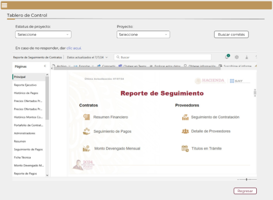
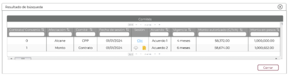
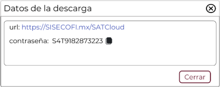

||Administración General de Comunicaciones y Tecnologías de la Información|
| :- | -: |
||Marco Documental 7.0|
|Fecha de aprobación del Template: 02/08/2023|
**Especificación de Interacción de Usuario**

17\_3083\_EIU\_ConsultarTableroDeControl.docx
|Versión del template: 7.00|
| :-: | :-: | :-: |

**<ID Requerimiento>** 8309

**Nombre del Requerimiento:** TI\_SISECOFI-SAT\_Seguimiento financiero y control documental de proyectos de contratación

## **Tabla de Versiones y Modificaciones**

|Versión|Descripción del cambio|Responsable de la Versión|Fecha|
| :-: | :- | :- | :-: |
|*1*|*Creación del documento*|Eduardo Acosta Mora|*10/07/2024*|
|*1.1*|*Revisión del documento*|Diana Yazmín Pérez Sabido|*01/08/2024*|
|*1.2*|*Versión aprobada para firma*|
María del Carmen Castillejos Cárdenas

Rubén Delgado Ramírez
|*01/08/2024*|

**TABLA DE CONTENIDO**

[Tabla de Versiones y Modificaciones	1](#_toc175158178)

[Módulo: Tablero de Control	2](#_toc175158179)

[ESTILOS 01	2](#_toc175158180)

[Descripción de Elementos	3](#_toc175158181)

[Descripción de Campos	3](#_toc175158182)

[ESTILOS 02	5](#_toc175158183)

[Descripción de Elementos	6](#_toc175158184)

[Descripción de Campos	7](#_toc175158185)

[ESTILOS 03	10](#_toc175158186)

[Descripción de Elementos	11](#_toc175158187)

[Descripción de Campos	11](#_toc175158188)

## **MÓDULO: TABLERO DE CONTROL**
## **ESTILOS 01**

|**Nombre de la Pantalla:**|Tablero de Control|
| :- | :- |
|**Objetivo:**|Permite al Empleado SAT visualizar el componente externo de “*Power BI”*.|
|**Casos de uso relacionados:**|17\_3083\_ECU\_ConsultarTableroDeControl|
|||

### **DESCRIPCIÓN DE ELEMENTOS** 

|**Elemento**|**Descripción**|
| :- | :- |
|![ref1]|Opción que al seleccionarla muestra el menú principal desplegado en la parte izquierda de la pantalla; contiene los módulos principales y submódulos de este sistema.|
|Tablero de control|Título del encabezado que identifica el submódulo a donde se está ingresando.|
|Estatus del proyecto|Campo que permite seleccionar el o los estatus del proyecto.|
|Proyecto|Campo que permite seleccionar un proyecto.|
|Buscar comités|Opción que permite iniciar la búsqueda de los comités en la base de datos (BD) de acuerdo con lo seleccionado en los filtros de búsqueda.|
|En caso de que no responder, dar clic aquí:|Muestra el vínculo del componente *Power BI*.|
|![ref2]|Componente externo “*Power BI”.*|
|Regresar|Opción que permite regresar a la pantalla anterior.|

### **DESCRIPCIÓN DE CAMPOS**

|**Elemento**|**Tipo**|**Longitud**|
**Nivel de Acceso**

**(L, E, S)**
|**Descripción del Campo**|**Fórmulas**|**Precisiones**|
| :-: | :-: | :-: | :-: | :-: | :-: | :-: |
|![ref1]|Ícono|N/A|S|Opción que al seleccionarla muestra el menú principal desplegado en la parte izquierda de la pantalla; contiene los módulos principales y submódulos de este sistema.|N/A|N/A|
|Tablero de Control|Texto|N/A|L|Título del encabezado que identifica el submódulo a donde se está ingresando.|N/A|N/A|
|Estatus del proyecto|Lista de selección|N/A|S|Campo que permite seleccionar el o los estatus del proyecto.|N/A|
Lista de selección múltiple.

Se debe de contar con la opción “Todos”.
|
|Proyecto|Lista de selección|N/A|S|Campo que permite seleccionar un proyecto.|N/A|Los proyectos mostrados son resultado de lo seleccionado en el campo “Estatus del proyecto”|
|Buscar comités|Botón|N/A|S|Opción que permite iniciar la búsqueda de los comités en la base de datos (BD) de acuerdo con lo seleccionado en los filtros de búsqueda.|N/A|
Inicialmente se muestra sin color de fondo y con contorno y letras en color gris.

Cuando se pone el cursor encima debe cambiar a fondo gris y letras negras.
|
|En caso de que no responder, dar clic aquí:|Enlace|N/A|S|Enlace que permite abrir el componente “Power BI” en otra ventana.|N/A|
Abrirá el enlace en una nueva pestaña del navegador.

La palabra “clic aquí” será la que contenga el enlace.
|
|![ref2]|*“Power BI”*|N/A|L|Componente externo “*Power BI”*.|N/A|N/A|
|Regresar|Botón|N/A|S|Opción que permite regresar a la pantalla anterior.|N/A|
Inicialmente se muestra sin color de fondo y con el texto y contorno en color guinda (#691c32).

Cuando se le pone el cursor encima debe cambiar a fondo guinda (#691c32) y letras blancas.
|

## **ESTILOS 02**

|**Nombre de la Pantalla:**|Resultado de búsqueda|
| :- | :- |
|**Objetivo:**|Permite al Empleado SAT visualizar los comités que pertenezcan a un proyecto.|
|**Casos de uso relacionados:**|17\_3083\_ECU\_ConsultarTableroDeControl|
|||

### **DESCRIPCIÓN DE ELEMENTOS** 

|**Elemento**|**Descripción**|
| :- | :- |
|Resultado de búsqueda|Título de la ventana emergente.|
|![ref3]|Opción que permite cerrar la ventana emergente.|
|Comités|Título de la tabla.|
|![ref4]|Paginador que permite navegar a través de las páginas resultantes de la consulta, considerando que el sistema debe mostrar inicialmente 15 registros por página, permitiendo elegir visualizar 15, 50 y 100 registros por página.|
|Contrato/ Convenio|Indica el Contrato/Convenio del comité.|
|Afectación|Indica la afectación del comité.|
|Comité|Indica el nombre del comité.|
|Fecha de sesión|Indica la fecha de sesión del comité.|
|Sesión|Indica el enlace de descarga o los íconos del tipo de descarga a realizar.|
|Acuerdo|Indica el acuerdo del comité.|
|Vigencia|Indica la vigencia del acuerdo.|
|Monto autorizado (C/IVA)|Indica el monto autorizado (con IVA).|
|Monto en pesos|Indica el monto en moneda nacional mexicana.|
|![ref5]|Opción que ordena la información de la tabla de forma ascendente o descendente y de forma alfabética, según aplique.|
|![ref6]![ref6]![ref7]|Campo que permite filtrar la información de la columna en la que se requiere buscar específicamente.|
|` `![ref8]|
Opción que permite la descarga masiva en .ZIP, se exportarán todos los documentos de la carpeta asociada a la fase “Comité”.

**Nota:** este ícono aparecerá cuando haya más de 2 archivos adjuntos. 
|
|![ref9]|
Opción que permite descargar la documentación de la carpeta asociada a la fase “Comité” mediante la descarga SATCloud.

**Nota:** este ícono aparecerá cuando haya más de 2 archivos adjuntos.
|
|![ref10]|Permite desplazarse de manera horizontal en la tabla.|
|![ref11]|Permite desplazarse de manera vertical en la tabla. |
|Cerrar|Opción que permite cerrar la ventana.|

### **DESCRIPCIÓN DE CAMPOS**

|**Elemento**|**Tipo**|**Longitud**|
**Nivel de Acceso**

**(L, E, S)**
|**Descripción del Campo**|**Fórmulas**|**Precisiones**|
| :-: | :-: | :-: | :-: | :-: | :-: | :-: |
|Resultado de búsqueda|Texto|N/A|L|Título de la ventana emergente.|N/A|N/A|
|![ref3]|Ícono|N/A|S|Opción que permite cerrar la ventana emergente.|N/A|Usar *tooltip* que muestre el nombre de la opción “Cerrar ventana”.|
|Comités|Texto|N/A|L|Título de la tabla.|N/A|N/A|
|![ref4]|Paginador|N/A|S|Permite navegar a través de las páginas resultantes de la consulta.|N/A|Inicialmente se deben mostrar 15 registros por página, permitiendo seleccionar el visualizar 15, 50 y 100 registros por página.|
|Contrato/ Convenio|Numérico|2|L|Campo que indica el Contrato/Convenio del comité.|N/A|N/A|
|Afectación|Alfanumérico|N/A|L|Campo que indica la afectación del comité.|N/A|N/A|
|Comité|Alfanumérico|N/A|L|Campo que indica el nombre del comité.|N/A|N/A|
|Fecha de sesión|Fecha|10|L|Campo que indica la fecha de sesión del comité.|N/A|Formato de fecha DD/MM/AAAA|
|Sesión|Enlace|N/A|S|Indica el enlace de descarga o los íconos del tipo de descarga a realizar.|N/A|N/A|
|Acuerdo|Alfanumérico|100|L|Indica el acuerdo del comité.|N/A|N/A|
|Vigencia|Alfanumérico|100|L|Indica la vigencia del acuerdo.|N/A|N/A|
|Monto autorizado (C/IVA)|Numérico (decimal)|14|L|Campo que indica el monto autorizado (con IVA).|N/A|
Muestra el valor con formato $ 0.00 que comprende 12 enteros con separación de miles y 2 decimales. Ejemplo:

$999,999,999,999.00.
|
|Monto en pesos|Numérico (decimal)|14|L|Campo que indica el monto en moneda nacional mexicana.|Monto en pesos= ((Monto autorizado(C/IVA)) \* (Tipo de cambio))|Muestra el valor con formato $ 0.00 que comprende 12 enteros con separación de miles y 2 decimales. Ejemplo: $999,999,999,999.00.|
|![ref5]|Ícono|N/A|S|Opción que ordena la información de la tabla de forma ascendente o descendente y de forma alfabética, según aplique.|N/A|N/A|
|![ref12]|Filtro|N/A|E|Campo que permite filtrar la información de la columna en la que se requiere buscar específicamente.|N/A|Realiza el filtro de la información solo dentro de la página que se visualiza.|
|![ref8]|Ícono|N/A|S|Opción que permite la descarga masiva en .ZIP, se exportarán todos los documentos de la carpeta asociada a la fase “Comité”.|N/A|
Este ícono aparecerá cuando haya más de 2 archivos adjuntos.

Usar *tooltip* que muestre el nombre de la opción “Descarga masiva”.
|
|![ref9]|Ícono|N/A|S|Opción que permite descargar la documentación de la carpeta asociada a la fase “Comité” mediante la descarga SATCloud.|N/A|
Este ícono aparecerá cuando haya más de 2 archivos adjuntos.

Usar *tooltip* que muestre el nombre de la opción “SATCloud”.
|
|![ref10]|Barra de desplazamiento|N/A|S|Permite desplazarse de manera horizontal en la tabla.|N/A|N/A|
|![ref11]|Barra de desplazamiento|N/A|S|Permite desplazarse de manera vertical en la tabla.|N/A|N/A|
|Cerrar|Botón|N/A|S|Opción que permite cerrar la ventana.|N/A|
Inicialmente se muestra sin color de fondo y con el texto y contorno en color guinda (#691c32).

Cuando se le pone el cursor encima debe cambiar a fondo guinda (#691c32) y letras blancas.
|

## **ESTILOS 03**

|**Nombre de la Pantalla:**|Datos de la descarga|
| :- | :- |
|**Objetivo:**|
Ventana que muestra el enlace y contraseña para la descarga en SATCloud.

|
|**Casos de uso relacionados:**|17\_3083\_ECU\_ConsultarTableroDeControl|
|||

### **DESCRIPCIÓN DE ELEMENTOS** 

|**Elemento**|**Descripción**|
| :- | :- |
|Datos de la descarga|Título de la ventana.|
||Opción que permite cerrar la ventana.|
|url:|Campo que muestra la url del enlace donde se encuentra el documento a descargar en SATCloud.|
|contraseña:|Campo que muestra la contraseña para permitir la descarga del archivo en SATCloud.|
|![ref13]|Opción que permite copiar la contraseña.|
|Cerrar|Opción que permite cerrar la ventana.|

### **DESCRIPCIÓN DE CAMPOS**

|**Elemento**|**Tipo**|**Longitud**|
**Nivel de Acceso**

**(L, E, S)**
|**Descripción del Campo**|**Fórmulas**|**Precisiones**|
| :-: | :-: | :-: | :-: | :-: | :-: | :-: |
|Datos de la descarga|Texto|N/A|L|Título de la ventana.|N/A|N/A|
||Ícono|N/A|S|Opción que permite cerrar la ventana.|N/A|Usar *tooltip* que muestre el nombre de la opción “Cerrar ventana”.|
|url:|Texto|N/A|S|Campo que muestra la url del enlace donde se encuentra el documento a descargar en SATCloud.|N/A|N/A|
|contraseña:|Texto|N/A|L|Campo que muestra la contraseña para permitir la descarga del archivo en SATCloud.|N/A|N/A|
|![ref13]|Ícono|N/A|S|Opción que permite copiar la contraseña.|N/A|N/A|
|Cerrar|Botón|N/A|S|Opción que permite cerrar la ventana.|N/A|
Inicialmente se muestra sin color de fondo y con el texto y contorno en color guinda (#691c32).

Cuando se le pone el cursor encima debe cambiar a fondo guinda (#691c32) y letras blancas.
|

Anexo - Ejemplos de botones

Las acciones de cada botón se definen en los estilos correspondientes.

|**FIRMAS DE CONFORMIDAD** ||
| :-: | :- |
|**Firma 1**  |**Firma 2**  |
|**Nombre**: Diana Yazmín Pérez Sabido.|**Nombre**: Rodolfo López Meneses. |
|**Puesto**: Usuaria ACPPI.|**Puesto**: Usuario ACPPI.|
|**Fecha:** |**Fecha:** |
|  |  |
|**Firma 3**  |**Firma 4** |
|**Nombre**: Rubén Delgado Ramírez. |**Nombre**: María del Carmen Castillejos Cárdenas. |
|**Puesto**: Usuario ACPPI. |**Puesto**: APE ACPPI. |
|**Fecha:** |**Fecha:** |
|  |  |
|**Firma 5** |**Firma 6** |
|**Nombre**: Alejandro Alfredo Muñoz Núñez. |**Nombre**: Erick Villa Beltrán. |
|**Puesto**: RAPE ACPPI. |**Puesto**: Líder APE SDMA 6. |
|**Fecha**: |**Fecha**: |
|  |  |
|**Firma 7**|**Firma 8**|
|**Nombre**: Juan Carlos Ayuso Bautista. |**Nombre**: Eduardo Acosta Mora|
|**Puesto**: Líder Técnico SDMA 6. |**Puesto**: Analista SDMA 6.|
|**Fecha**: |**Fecha**: |
|||

|||Página 6 de 6|
| :- | :-: | -: |

[ref1]: Aspose.Words.2fa2ab00-7c50-46c9-aa2b-5b832a9334f5.003.png
[ref2]: Aspose.Words.2fa2ab00-7c50-46c9-aa2b-5b832a9334f5.004.png
[ref3]: Aspose.Words.2fa2ab00-7c50-46c9-aa2b-5b832a9334f5.006.png
[ref4]: Aspose.Words.2fa2ab00-7c50-46c9-aa2b-5b832a9334f5.007.png
[ref5]: Aspose.Words.2fa2ab00-7c50-46c9-aa2b-5b832a9334f5.008.png
[ref6]: Aspose.Words.2fa2ab00-7c50-46c9-aa2b-5b832a9334f5.009.png
[ref7]: Aspose.Words.2fa2ab00-7c50-46c9-aa2b-5b832a9334f5.010.png
[ref8]: Aspose.Words.2fa2ab00-7c50-46c9-aa2b-5b832a9334f5.011.png
[ref9]: Aspose.Words.2fa2ab00-7c50-46c9-aa2b-5b832a9334f5.012.png
[ref10]: Aspose.Words.2fa2ab00-7c50-46c9-aa2b-5b832a9334f5.013.png
[ref11]: Aspose.Words.2fa2ab00-7c50-46c9-aa2b-5b832a9334f5.014.png
[ref12]: Aspose.Words.2fa2ab00-7c50-46c9-aa2b-5b832a9334f5.015.png
[ref13]: Aspose.Words.2fa2ab00-7c50-46c9-aa2b-5b832a9334f5.018.png
