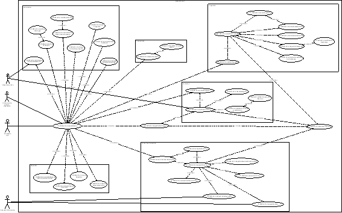

||**Administración General de Comunicaciones y Tecnologías de la Información**|
| :- | -: |
||Marco Documental 7.0|
|
Fecha de aprobación del Template:

03/10/2023
|
**Modelo de Casos de Uso**

17\_3083\_MCU\_SeguimientoFinancieroYControl.docx** 

|Versión del template: 7.00|
| :-: | :-: | :-: |

**<ID Requerimiento> 8309**

**Nombre del Requerimiento:** TI\_SISECOFI-SAT\_Seguimiento financiero y control documental de proyectos de contratación.
# **TABLA DE VERSIONES Y MODIFICACIONES**

|Versión|
Descripción del cambio

|
Responsable de la Versión

|
Fecha

|
| :-: | :-: | :-: | :-: |
|*1*|*Creación del documento*|
Lucina García Vargas

María del Carmen Gutiérrez Sánchez.
|*20/07/2024*|
|*1.1*|*Revisión del documento*|Rodolfo López Meneses.|*27/07/2024*|
|*1.2*|*Versión aprobada para firma*|
María del Carmen Castillejos Cárdenas.

Rubén Delgado Ramírez.
|*29/07/2024*|
|*2*|*Actualización de roles para homologación con el MLPI*|María del Carmen Gutiérrez Sánchez.|*02/09/2024*|
|*2.1*|*Revisión del documento*|Rodolfo López Meneses.|*04/09/2024*|
|*2.2*|*Versión aprobada para firma*|
María del Carmen Castillejos Cárdenas.

Rubén Delgado Ramírez.
|*04/09/2024*|

**Tabla de Contenido**

[Tabla de Versiones y Modificaciones	1](#_toc176342657)

[Modelo de casos de uso	6](#_toc176342658)

[Nombre del actor: Empleado SAT	6](#_toc176342659)

[Descripción	6](#_toc176342660)

[Características/Responsabilidades	6](#_toc176342661)

[Relaciones de comunicación	12](#_toc176342662)

[Relaciones de generalización	12](#_toc176342663)

[Nombre del actor: Directorio Activo	13](#_toc176342664)

[Descripción:	13](#_toc176342665)

[Características/Responsabilidades	13](#_toc176342666)

[Relaciones de comunicación	13](#_toc176342667)

[Relaciones de generalización	13](#_toc176342668)

[Nombre del actor: Componente externo de acceso	13](#_toc176342669)

[Descripción:	13](#_toc176342670)

[Características/Responsabilidades	13](#_toc176342671)

[Relaciones de comunicación	13](#_toc176342672)

[Relaciones de generalización	13](#_toc176342673)

[Nombre del actor: Consulta CFDI Service	13](#_toc176342674)

[Descripción:	13](#_toc176342675)

[Características/Responsabilidades	13](#_toc176342676)

[Relaciones de comunicación	13](#_toc176342677)

[Descripción del sistema/subsistema	14](#_toc176342678)

[**Sistema/Subsistema**	14](#_toc176342679)

[**Objetivo**	14](#_toc176342680)

[**Casos de uso relacionados**	14](#_toc176342681)

[**Nombre del Caso de Uso**: 17_3083_ECU_AccesoSistema	14](#_toc176342682)

[Propósito del Caso de Uso	14](#_toc176342683)

[Relaciones de comunicación	14](#_toc176342684)

[Relaciones de tipo *<<include>>*	14](#_toc176342685)

[Relaciones de tipo *<<extend>>*	14](#_toc176342686)

[**Nombre del Caso de Uso**: 17_3083_ECU_AdministrarUsuariosDelSistema	15](#_toc176342687)

[Propósito del Caso de Uso	15](#_toc176342688)

[Relaciones de comunicación	15](#_toc176342689)

[Relaciones de tipo <<include>>	15](#_toc176342690)

[Relaciones de tipo *<<extend>>*	15](#_toc176342691)

[**Nombre del Caso de Uso**: 07_843_AltaDeCatalogos	15](#_toc176342692)

[Propósito del Caso de Uso	15](#_toc176342693)

[Relaciones de comunicación	15](#_toc176342694)

[Relaciones de tipo *<<include>>*	15](#_toc176342695)

[Relaciones de tipo *<<extend>>*	15](#_toc176342696)

[**Nombre del Caso de Uso**: 17_3083_ECU_ModificarCatalogos	15](#_toc176342697)

[Propósito del Caso de Uso	15](#_toc176342698)

[Relaciones de comunicación	15](#_toc176342699)

[Relaciones de tipo *<<include>>*	15](#_toc176342700)

[Relaciones de tipo *<<extend>>*	15](#_toc176342701)

[**Nombre del Caso de Uso**: 17_3083_ECU_AsignarProyectos	16](#_toc176342702)

[Propósito del Caso de Uso	16](#_toc176342703)

[Relaciones de comunicación	16](#_toc176342704)

[Relaciones de tipo *<<include>>*	16](#_toc176342705)

[Relaciones de tipo *<<extend>>*	16](#_toc176342706)

[**Nombre del Caso de Uso**: 17_3083_ECU_AdministradorDeFormatosImpresion	16](#_toc176342707)

[Propósito del Caso de Uso	16](#_toc176342708)

[Relaciones de comunicación	16](#_toc176342709)

[Relaciones de tipo *<<include>>*	16](#_toc176342710)

[Relaciones de tipo *<<extend>>*	16](#_toc176342711)

[**Nombre del Caso de Uso**: 17_3083_ECU_ModificarPlantillas	16](#_toc176342712)

[Propósito del Caso de Uso	16](#_toc176342713)

[Relaciones de comunicación	16](#_toc176342714)

[Relaciones de tipo *<<include>>*	16](#_toc176342715)

[Relaciones de tipo *<<extend>>*	16](#_toc176342716)

[**Nombre del Caso de Uso**: 17_3083_ECU_ConsultarPistasAuditoria	17](#_toc176342717)

[Propósito del Caso de Uso	17](#_toc176342718)

[Relaciones de comunicación	17](#_toc176342719)

[Relaciones de tipo *<<include>>*	17](#_toc176342720)

[Relaciones de tipo *<<extend>>*	17](#_toc176342721)

[**Nombre del Caso de Uso**: 17_3083_ECU_ConsultarPapeleradeReciclaje	17](#_toc176342722)

[Propósito del Caso de Uso	17](#_toc176342723)

[Relaciones de comunicación	17](#_toc176342724)

[Relaciones de tipo *<<include>>*	17](#_toc176342725)

[Relaciones de tipo *<<extend>>*	17](#_toc176342726)

[**Nombre del Caso de Uso**: 17_3083_ECU_ConfigurarControlDocumentos	17](#_toc176342727)

[Propósito del Caso de Uso	17](#_toc176342728)

[Relaciones de comunicación	17](#_toc176342729)

[Relaciones de tipo *<<include>>*	17](#_toc176342730)

[Relaciones de tipo *<<extend>>*	17](#_toc176342731)

[**Nombre del Caso de Uso**: 17_3083_ECU_AltaDeProveedor	18](#_toc176342732)

[Propósito del Caso de Uso	18](#_toc176342733)

[Relaciones de comunicación	18](#_toc176342734)

[Relaciones de tipo *<<include>>*	18](#_toc176342735)

[Relaciones de tipo *<<extend>>*	18](#_toc176342736)

[**Nombre del Caso de Uso**: 17_3083_ECU_ModificarInfoDeProveedor	18](#_toc176342737)

[Propósito del Caso de Uso	18](#_toc176342738)

[Relaciones de comunicación	18](#_toc176342739)

[Relaciones de tipo *<<include>>*	18](#_toc176342740)

[Relaciones de tipo *<<extend>>*	18](#_toc176342741)

[**Nombre del Caso de Uso**: 17_3083_ECU_AltaDeProyecto	18](#_toc176342742)

[Propósito del Caso de Uso	18](#_toc176342743)

[Relaciones de comunicación	18](#_toc176342744)

[Relaciones de tipo *<<include>>*	18](#_toc176342745)

[Relaciones de tipo *<<extend>>*	18](#_toc176342746)

[**Nombre del Caso de Uso**: 17_3083_ECU_ModificarProyecto	19](#_toc176342747)

[Propósito del Caso de Uso	19](#_toc176342748)

[Relaciones de comunicación	19](#_toc176342749)

[Relaciones de tipo *<<include>>*	19](#_toc176342750)

[Relaciones de tipo *<<extend>>*	19](#_toc176342751)

[**Nombre del Caso de Uso**: 17_3083_ECU_AsociarFasesMatrizDoc	19](#_toc176342752)

[Propósito del Caso de Uso	19](#_toc176342753)

[Relaciones de comunicación	19](#_toc176342754)

[Relaciones de tipo *<<include>>*	19](#_toc176342755)

[Relaciones de tipo *<<extend>>*	19](#_toc176342756)

[**Nombre del Caso de Uso**: 17_3083_ECU_AdministraInfoComites	19](#_toc176342757)

[Propósito del Caso de Uso	19](#_toc176342758)

[Relaciones de comunicación	19](#_toc176342759)

[Relaciones de tipo *<<include>>*	19](#_toc176342760)

[Relaciones de tipo *<<extend>>*	19](#_toc176342761)

[**Nombre del Caso de Uso**: 17_3083_ECU_CargarPlanDeTrabajo	20](#_toc176342762)

[Propósito del Caso de Uso	20](#_toc176342763)

[Relaciones de comunicación	20](#_toc176342764)

[Relaciones de tipo *<<include>>*	20](#_toc176342765)

[Relaciones de tipo *<<extend>>*	20](#_toc176342766)

[**Nombre del Caso de Uso**: 17_3083_ECU_ModificarPlanDeTrabajo	20](#_toc176342767)

[Propósito del Caso de Uso	20](#_toc176342768)

[Relaciones de comunicación	20](#_toc176342769)

[Relaciones de tipo *<<include>>*	20](#_toc176342770)

[Relaciones de tipo *<<extend>>*	20](#_toc176342771)

[**Nombre del Caso de Uso**: 17_3083_ECU_AsignarProveedoresParticipantes	20](#_toc176342772)

[Propósito del Caso de Uso	20](#_toc176342773)

[Relaciones de comunicación	20](#_toc176342774)

[Relaciones de tipo *<<include>>*	20](#_toc176342775)

[Relaciones de tipo *<<extend>>*	20](#_toc176342776)

[**Nombre del Caso de Uso**: 17_3083_ECU_CerrarProyecto	21](#_toc176342777)

[Propósito del Caso de Uso	21](#_toc176342778)

[Relaciones de comunicación	21](#_toc176342779)

[Relaciones de tipo *<<include>>*	21](#_toc176342780)

[Relaciones de tipo *<<extend>>*	21](#_toc176342781)

[**Nombre del Caso de Uso**: 17_3083_ECU_AltaDeContrato	21](#_toc176342782)

[Propósito del Caso de Uso	21](#_toc176342783)

[Relaciones de comunicación	21](#_toc176342784)

[Relaciones de tipo *<<include>>*	21](#_toc176342785)

[Relaciones de tipo *<<extend>>*	21](#_toc176342786)

[**Nombre del Caso de Uso**: 17_3083_ECU_ModificarContrato	21](#_toc176342787)

[Propósito del Caso de Uso	21](#_toc176342788)

[Relaciones de comunicación	21](#_toc176342789)

[Relaciones de tipo *<<include>>*	21](#_toc176342790)

[Relaciones de tipo *<<extend>>*	21](#_toc176342791)

[**Nombre del Caso de Uso**: 17_3083_ECU_CasoDeNegocio	22](#_toc176342792)

[Propósito del Caso de Uso	22](#_toc176342793)

[Relaciones de comunicación	22](#_toc176342794)

[Relaciones de tipo *<<include>>*	22](#_toc176342795)

[Relaciones de tipo *<<extend>>*	22](#_toc176342796)

[**Nombre del Caso de Uso**: 17_3083_ECU_RegistrarConvenioModificatorio	22](#_toc176342797)

[Propósito del Caso de Uso	22](#_toc176342798)

[Relaciones de comunicación	22](#_toc176342799)

[Relaciones de tipo *<<include>>*	22](#_toc176342800)

[Relaciones de tipo *<<extend>>*	22](#_toc176342801)

[**Nombre del Caso de Uso**: 17_3083_ECU_EditarConvenioModificatorio	22](#_toc176342802)

[Propósito del Caso de Uso	22](#_toc176342803)

[Relaciones de comunicación	22](#_toc176342804)

[Relaciones de tipo *<<include>>*	22](#_toc176342805)

[Relaciones de tipo *<<extend>>*	22](#_toc176342806)

[**Nombre del Caso de Uso**: 17_3083_ECU_RegistrarReintegro	23](#_toc176342807)

[Propósito del Caso de Uso	23](#_toc176342808)

[Relaciones de comunicación	23](#_toc176342809)

[Relaciones de tipo *<<include>>*	23](#_toc176342810)

[Relaciones de tipo *<<extend>>*	23](#_toc176342811)

[**Nombre del Caso de Uso**: 17_3083_ECU_AdministrarDevengado	23](#_toc176342812)

[Propósito del Caso de Uso	23](#_toc176342813)

[Relaciones de comunicación	23](#_toc176342814)

[Relaciones de tipo *<<include>>*	23](#_toc176342815)

[Relaciones de tipo *<<extend>>*	23](#_toc176342816)

[**Nombre del Caso de Uso**: 17_3083_ECU_CrearEstimación	23](#_toc176342817)

[Propósito del Caso de Uso	23](#_toc176342818)

[Relaciones de comunicación	23](#_toc176342819)

[Relaciones de tipo *<<include>>*	23](#_toc176342820)

[Relaciones de tipo *<<extend>>*	23](#_toc176342821)

[**Nombre del Caso de Uso**: 17_3083_ECU_GenerarDictamen	24](#_toc176342822)

[Propósito del Caso de Uso	24](#_toc176342823)

[Relaciones de comunicación	24](#_toc176342824)

[Relaciones de tipo *<<include>>*	24](#_toc176342825)

[Relaciones de tipo *<<extend>>*	24](#_toc176342826)

[**Nombre del Caso de Uso**: 17_3083_ECU_RegistrarServiciosDictaminados	24](#_toc176342827)

[Propósito del Caso de Uso	24](#_toc176342828)

[Relaciones de comunicación	24](#_toc176342829)

[Relaciones de tipo *<<include>>*	24](#_toc176342830)

[Relaciones de tipo *<<extend>>*	24](#_toc176342831)

[**Nombre del Caso de Uso**: 17_3083_ECU_EmitirProforma	24](#_toc176342832)

[Propósito del Caso de Uso	24](#_toc176342833)

[Relaciones de comunicación	24](#_toc176342834)

[Relaciones de tipo *<<include>>*	25](#_toc176342835)

[Relaciones de tipo *<<extend>>*	25](#_toc176342836)

[**Nombre del Caso de Uso**: 17_3083_ECU_GenerarFactura	25](#_toc176342837)

[Propósito del Caso de Uso	25](#_toc176342838)

[Relaciones de comunicación	25](#_toc176342839)

[Relaciones de tipo *<<include>>*	25](#_toc176342840)

[Relaciones de tipo *<<extend>>*	25](#_toc176342841)

[**Nombre del Caso de Uso**: 17_3083_ECU_GenerarNotaDeCredito	25](#_toc176342842)

[Propósito del Caso de Uso	25](#_toc176342843)

[Relaciones de comunicación	25](#_toc176342844)

[Relaciones de tipo *<<include>>*	25](#_toc176342845)

[Relaciones de tipo *<<extend>>*	25](#_toc176342846)

[**Nombre del Caso de Uso**: 17_3083_ECU_GenerarNotificaciónPago	25](#_toc176342847)

[Propósito del Caso de Uso	25](#_toc176342848)

[Relaciones de comunicación	25](#_toc176342849)

[Relaciones de tipo *<<include>>*	25](#_toc176342850)

[Relaciones de tipo *<<extend>>*	26](#_toc176342851)

[**Nombre del Caso de Uso**: 17_3083_ECU_GestionDocumental	26](#_toc176342852)

[Propósito del Caso de Uso	26](#_toc176342853)

[Relaciones de comunicación	26](#_toc176342854)

[Relaciones de tipo *<<include>>*	26](#_toc176342855)

[Relaciones de tipo *<<extend>>*	26](#_toc176342856)

[**Nombre del Caso de Uso**: 17_3083_ECU_ConsultarReporteDeControlDocumental	26](#_toc176342857)

[Propósito del Caso de Uso	26](#_toc176342858)

[Relaciones de comunicación	26](#_toc176342859)

[Relaciones de tipo *<<include>>*	26](#_toc176342860)

[Relaciones de tipo *<<extend>>*	26](#_toc176342861)

[**Nombre del Caso de Uso**: 17_3083_ECU_GenerarReporteFinanciero	26](#_toc176342862)

[Propósito del Caso de Uso	26](#_toc176342863)

[Relaciones de comunicación	27](#_toc176342864)

[Relaciones de tipo *<<include>>*	27](#_toc176342865)

[Relaciones de tipo *<<extend>>*	27](#_toc176342866)

[**Nombre del Caso de Uso**: 17_3083_ECU_ConstruirReportes	27](#_toc176342867)

[Propósito del Caso de Uso	27](#_toc176342868)

[Relaciones de comunicación	27](#_toc176342869)

[Relaciones de tipo *<<include>>*	27](#_toc176342870)

[Relaciones de tipo *<<extend>>*	27](#_toc176342871)

[**Nombre del Caso de Uso**: 17_3083_ECU_ConsultarTableroDeControl	27](#_toc176342872)

[Propósito del Caso de Uso	27](#_toc176342873)

[Relaciones de comunicación	27](#_toc176342874)

[Relaciones de tipo *<<include>>*	27](#_toc176342875)

[Relaciones de tipo <<extend	27](#_toc176342876)

## **MODELO DE CASOS DE USO** 

**Descripción de actores**

Nombre del actor: Empleado SAT

Descripción 

El Empleado SAT es el que tiene el o los roles otorgados por la Administración Central de Seguridad, Monitoreo y Control (ACSMC) para ingresar a cada uno de los módulos de este sistema.

Características/Responsabilidades

Como “Administrador del sistema” podrá ingresar a las siguientes opciones del menú:

- Sistema
- Catálogos
- Usuarios
- Asignar proyectos
- Matriz documental
- Formatos de impresión
- Pistas de auditoría
- Papelera de reciclaje
- Proveedores
- Proyectos
- Contratos
- Consumo de servicios
- Reintegros
- Reportes
- Reporte de Control documental
- Construir reportes
- Reporte financiero
- Resumen financiero
- Seguimiento de dictamen
- Facturas / penalizaciones / deducciones / reintegros
- Estimado / pagado 
- Seguimiento por concepto de servicio
- Estado financiero
- Tablero de Control

Como “Administrador del Sistema Secundario” podrá ingresar a las siguientes opciones del menú:

- Sistema
- Catálogos
- Usuarios
- Asignar proyectos
- Matriz documental
- Formatos de impresión
- Pistas de auditoría
- Papelera de reciclaje
- Proveedores
- Proyectos
- Contratos
- Consumo de servicios
- Reintegros
- Reportes
- Reporte de Control documental
- Construir reportes
- Reporte financiero
- Resumen financiero
- Seguimiento de dictamen
- Facturas / penalizaciones / deducciones / reintegros
- Estimado / pagado 
- Seguimiento por concepto de servicio
- Estado financiero
- Tablero de Control

Como “Administrador Matriz Documental” podrá ingresar a las siguientes opciones del menú:

- Sistema
- Matriz documental
- Proyectos
- Contratos
- Reportes
- Reporte de Control documental

Como “Apoyo ACPPI” podrá ingresar a las siguientes opciones del menú:

- Proveedores
- Proyectos
- Contratos
- Consumo de servicios
- Reintegros
- Reportes
- Reporte de Control documental
- Construir reportes
- Reporte financiero
- Resumen financiero
- Seguimiento de dictamen
- Facturas / penalizaciones / deducciones / reintegros
- Estimado / pagado 
- Seguimiento por concepto de servicio
- Estado financiero
- Tablero de Control

Como “Apoyo al Líder de Proyecto” podrá ingresar a las siguientes opciones del menú:

- Proyectos
- Contratos
- Reportes
- Reporte de Control documental

Como “Gestor Títulos de Autorización” podrá ingresar a las siguientes opciones del menú:

- Proveedores
- Tablero de Control

Como “Gestor Documental Contrato” podrá ingresar a las siguientes opciones del menú:

- Contratos
- Reportes
- Reporte de Control documental

Como “Usuario Consulta” podrá ingresar a las siguientes opciones del menú:

- Proveedores
- Proyectos
- Contratos
- Consumo de servicios
- Reintegros
- Reportes
- Reporte de Control documental
- Construir reportes
- Reporte financiero
- Resumen financiero
- Seguimiento de dictamen
- Facturas / penalizaciones / deducciones / reintegros
- Estimado / pagado 
- Seguimiento por concepto de servicio
- Estado financiero
- Tablero de Control

Como “Líder de Proyecto” podrá ingresar a las siguientes opciones del menú:

- Proveedores
- Proyectos
- Contratos
- Consumo de servicios
- Reintegros
- Reportes
- Reporte de Control documental
- Construir reportes
- Reporte financiero
- Resumen financiero
- Seguimiento de dictamen
- Facturas / penalizaciones / deducciones / reintegros
- Estimado / pagado 
- Seguimiento por concepto de servicio
- Estado financiero
- Tablero de Control

Como “Administrados de Contrato” podrá ingresar a las siguientes opciones del menú:

- Proveedores
- Proyectos
- Contratos
- Consumo de servicios
- Reintegros
- Reportes
- Reporte de Control documental
- Construir reportes
- Reporte financiero
- Resumen financiero
- Seguimiento de dictamen
- Facturas / penalizaciones / deducciones / reintegros
- Estimado / pagado 
- Seguimiento por concepto de servicio
- Estado financiero
- Tablero de Control

Como “Participantes en la Administración de Estimaciones” podrá ingresar a las siguientes opciones del menú:

- Consumo de servicios
- Reportes
- Reporte financiero
- Resumen financiero
- Estimado / pagado 
- Seguimiento por concepto de servicio

Como “Participantes en la Administración de Dictamen” podrá ingresar a las siguientes opciones del menú:

- Proyectos
- Contratos
- Consumo de servicios
- Reportes
- Construir reportes
- Reporte financiero
- Resumen financiero
- Seguimiento de dictamen
- Facturas / penalizaciones / deducciones / reintegros
- Estimado / pagado 
- Seguimiento por concepto de servicio
- Estado financiero
- Tablero de Control

Como “Participantes en la Administración de la Verificación” podrá ingresar a las siguientes opciones del menú:

- Proyectos
- Contratos
- Consumo de servicios
- Reintegros
- Reportes
- Reporte de Control documental
- Construir reportes
- Reporte financiero
- Resumen financiero
- Seguimiento de dictamen
- Facturas / penalizaciones / deducciones / reintegros
- Estimado / pagado 
- Seguimiento por concepto de servicio
- Estado financiero
- Tablero de Control

Como “Verificador General” podrá ingresar a las siguientes opciones del menú:

- Proveedores
- Proyectos
- Contratos
- Consumo de servicios
- Reintegros
- Reportes
- Reporte de Control documental
- Construir reportes
- Reporte financiero
- Resumen financiero
- Seguimiento de dictamen
- Facturas / penalizaciones / deducciones / reintegros
- Estimado / pagado 
- Seguimiento por concepto de servicio
- Estado financiero
- Tablero de Control

Como “Verificador Especifico del Contrato” podrá ingresar a las siguientes opciones del menú:

- Proveedores
- Proyectos
- Contratos
- Consumo de servicios
- Reintegros
- Reportes
- Reporte de Control documental
- Construir reportes
- Reporte financiero
- Resumen financiero
- Seguimiento de dictamen
- Facturas / penalizaciones / deducciones / reintegros
- Estimado / pagado 
- Seguimiento por concepto de servicio
- Estado financiero
- Tablero de Control

Como “Todos Los Proyectos” podrá ingresar a las siguientes opciones del menú:

- Proyectos
- Contratos

Relaciones de comunicación

- 17\_3083\_ECU\_AccesoSistema
- 17\_3083\_ECU\_AdministrarUsuariosDelSistema
- 17\_3083\_ECU\_AltaDeCatalogos
- 17\_3083\_ECU\_ModificarCatalogos
- 17\_3083\_ECU\_AsignarProyectos
- 17\_3083\_ECU\_AsociarFasesMatrizDoc
- 17\_3083\_ECU\_AdministradorDeFormatosImpresion
- 17\_3083\_ECU\_ModificarPlantillas
- 17\_3083\_ECU\_ConsultarPistasAuditoria
- 17\_3083\_ECU\_ConsultarPapeleradeReciclaje
- 17\_3083\_ECU\_ConfigurarControlDocumentos
- 17\_3083\_ECU\_AltaDeProveedor
- 17\_3083\_ECU\_ModificarInfoDeProveedor
- 17\_3083\_ECU\_AltaDeProyecto
- 17\_3083\_ECU\_ModificarProyecto
- 17\_3083\_ECU\_GestionDocumental
- 17\_3083\_ECU\_AdministrarInfoComites
- 17\_3083\_ECU\_CargarPlanDeTrabajo
- 17\_3083\_ECU\_ModificarPlanDeTrabajo
- 17\_3083\_ECU\_AsignarProveedoresParticipantes
- 17\_3083\_ECU\_CerrarProyecto
- 17\_3083\_ECU\_AltaDeContrato
- 17\_3083\_ECU\_CasoDeNegocio
- 17\_3083\_ECU\_ModificarContrato
- 17\_3083\_ECU\_RegistrarConvenioModificatorio
- 17\_3083\_ECU\_EditarConvenioModificatorio
- 17\_3083\_ECU\_RegistrarReintegro
- 17\_3083\_ECU\_AdministrarDevengado
- 17\_3083\_ECU\_CrearEstimacion
- 17\_3083\_ECU\_GenerarDictamen
- 17\_3083\_ECU\_RegistrarServiciosDictaminados
- 17\_3083\_ECU\_EmitirProforma
- 17\_3083\_ECU\_GenerarFactura
- 17\_3083\_ECU\_GenerarNotaDeCredito
- 17\_3083\_ECU\_GenerarNotificacionPago
- 17\_3083\_ECU\_ConsultarReporteDeControlDocumental
- 17\_3083\_ECU\_ConstruirReportes
- 17\_3083\_ECU\_GenerarReporteFinanciero
- 17\_3083\_ECU\_ConsultarTableroDeControl

Relaciones de generalización

- No aplica, no se requieren.

Nombre del actor: Directorio Activo

Descripción: 

Es el esquema donde se consulta la información de los empleados del SAT.

Características/Responsabilidades

Repositorio central de Empleados SAT activos, servidores, roles y puestos.

Relaciones de comunicación

- 17\_3083\_ECU\_AdministrarUsuariosDelSistema

Relaciones de generalización

No aplica, no se requieren.

Nombre del actor: Componente externo de acceso

Descripción: 

Sistema encargado de validar los datos del Empleado SAT que ingresa al portal a través de su e.firma y que proporciona la información de dicho Empleado SAT al SISECOFI. 

Características/Responsabilidades

Validar la identidad del Empleado SAT y permitir acceder al sistema SISECOFI.

Relaciones de comunicación

- 17\_3083\_ECU\_AccesoSistema

Relaciones de generalización

No aplica, no se requieren.

Nombre del actor: Consulta CFDI Service

Descripción: 

El servicio proporciona consultas detalladas relacionadas con el XML de las facturas asociadas a un proyecto, así como con el XML de las notas de crédito. Este servicio valida que ambos documentos se encuentren activos y correctamente vinculados al proyecto registrado en el sistema SISECOFI.

Características/Responsabilidades

Validar los datos de las facturas y notas de crédito agregadas al sistema. 

Relaciones de comunicación

- 17\_3083\_ECU\_GenerarFactura
- 17\_3083\_ECU\_GenerarNotaDeCredito

## **DESCRIPCIÓN DEL SISTEMA/SUBSISTEMA** 
### **SISTEMA/SUBSISTEMA**
TI\_SISECOFI-SAT\_Seguimiento financiero y control documental de proyectos de contratación
### **OBJETIVO**
Permitir la administración y control de proyectos, contratos, facturas y documentación derivada en sus diversas fases, conforme a las reglas de operación. Esto incluye el seguimiento y control financiero de los contratos, así como la revisión y validación de la información relacionada. Se considera también la adaptación a los posibles cambios en las reglas de operación a lo largo del ciclo de vida de los proyectos.

### **CASOS DE USO RELACIONADOS**

**Nombre del Caso de Uso**: 17\_3083\_ECU\_AccesoSistema

Propósito del Caso de Uso

El objetivo de este Caso de Uso es permitir al Empleado SAT ingresar al sistema SISECOFI para acceder a los módulos autorizados y realizar las operaciones correspondientes asignadas a su rol.

Relaciones de comunicación

- Componente externo de acceso

Relaciones de tipo *<<include>>*

- 17\_3083\_ECU\_AdministrarUsuariosDelSistema 
- 17\_3083\_ECU\_AltaDeCatalogos
- 17\_3083\_ECU\_AdministradorDeFormatosImpresion
- 17\_3083\_ECU\_ConfigurarControlDocumentos
- 17\_3083\_ECU\_AsignarProyectos
- 17\_3083\_ECU\_ConsultarPistasAuditoria
- 17\_3083\_ECU\_ConsultarPapeleradeReciclaje
- 17\_3083\_ECU\_AltaDeProveedor
- 17\_3083\_ECU\_AltaDeProyecto
- 17\_3083\_ECU\_AltaDeContrato
- 17\_3083\_ECU\_RegistrarReintegro
- 17\_3083\_ECU\_AdministrarDevengado
- 17\_3083\_ECU\_ConsultarReporteDeControlDocumental
- 17\_3083\_ECU\_GenerarReporteFinanciero
- 17\_3083\_ECU\_ConstruirReportes
- 17\_3083\_ECU\_ConsultarTableroDeControl

Relaciones de tipo *<<extend>>*

- No aplica, no se requieren.

**Nombre del Caso de Uso**: 17\_3083\_ECU\_AdministrarUsuariosDelSistema

Propósito del Caso de Uso

El objetivo de este Caso de Uso es permitir al Empleado SAT agregar al sistema usuarios que se encuentren en el Directorio Activo del SAT.

Relaciones de comunicación

- Directorio activo

Relaciones de tipo <<include>>

- 17\_3083\_ECU\_AccesoSistema

Relaciones de tipo *<<extend>>*

- No aplica, no se requieren

**Nombre del Caso de Uso**: 07\_843\_AltaDeCatalogos

Propósito del Caso de Uso

El objetivo de este Caso de Uso es permitir al Empleado SAT dar de alta un nuevo registro para un catálogo general o complementario. 

Relaciones de comunicación

- No aplica, no se requieren.

Relaciones de tipo *<<include>>*

- 17\_3083\_ECU\_AccesoSistema

Relaciones de tipo *<<extend>>*

- 17\_3083\_ECU\_ModificarCatalogos

**Nombre del Caso de Uso**: 17\_3083\_ECU\_ModificarCatalogos

Propósito del Caso de Uso

El objetivo de este Caso de Uso es permitir al Empleado SAT modificar un registro para un catálogo general o complementario.

Relaciones de comunicación

- No aplica, no se requieren.

Relaciones de tipo *<<include>>*

- No aplica, no se requieren.

Relaciones de tipo *<<extend>>*

- 17\_3083\_ECU\_AltaDeCatalogos

**Nombre del Caso de Uso**: 17\_3083\_ECU\_AsignarProyectos

Propósito del Caso de Uso

El objetivo de este Caso de Uso es permitir al Empleado SAT relacionar proyectos con usuarios que se encuentren registrados en este sistema.

Relaciones de comunicación

- No aplica, no se requieren.

Relaciones de tipo *<<include>>*

- 17\_3083\_ECU\_AccesoSistema

Relaciones de tipo *<<extend>>*

- No aplica, no se requieren

**Nombre del Caso de Uso**: 17\_3083\_ECU\_AdministradorDeFormatosImpresion

Propósito del Caso de Uso

El objetivo de este Caso de Uso es permitir al Empleado SAT visualizar la información de las plantillas previamente cargadas para: “Formato\_Sol\_Pago”, “Proforma Factura”, “Proforma Nota de crédito”, “Proforma Penalización”, “RCP” y “Plan de trabajo”. Además de permitirle generar nuevas versiones de las plantillas, ingresar a editar las ya existentes o cargar el plan tipo que requiera.

Relaciones de comunicación

- No aplica, no se requieren.

Relaciones de tipo *<<include>>*

- 17\_3083\_ECU\_AccesoSistema

Relaciones de tipo *<<extend>>*

- 17\_3083\_ECU\_ModificarPlantillas

**Nombre del Caso de Uso**: 17\_3083\_ECU\_ModificarPlantillas

Propósito del Caso de Uso

El objetivo de este Caso de Uso es permitir al Empleado SAT modificar las plantillas “Formato\_Sol\_Pago”, “Proforma Factura”, “Proforma Nota de crédito”, “Proforma Penalización” y “RCP” que se usan en el sistema; así como la descarga del documento de ayuda para la referencia de variables.

Relaciones de comunicación

- No aplica, no se requieren.

Relaciones de tipo *<<include>>*

- No aplica, no se requieren.

Relaciones de tipo *<<extend>>*

- 17\_3083\_ECU\_AdministradorDeFormatosImpresion

**Nombre del Caso de Uso**: 17\_3083\_ECU\_ConsultarPistasAuditoria

Propósito del Caso de Uso

El objetivo de este Caso de Uso es permitir al Empleado SAT consultar las Pistas de Auditoría, generadas por los movimientos en el sistema. 

Relaciones de comunicación

- No aplica, no se requieren

Relaciones de tipo *<<include>>*

- 17\_3083\_ECU\_AccesoSistema

Relaciones de tipo *<<extend>>*

- No aplica, no se requieren

**Nombre del Caso de Uso**: 17\_3083\_ECU\_ConsultarPapeleradeReciclaje

Propósito del Caso de Uso

El objetivo de este Caso de Uso es permitir al Empleado SAT que cuente con los roles necesarios, recuperar documentos eliminados, así como eliminar de forma permanente aquellos que no sean requeridos.

Relaciones de comunicación

- No aplica, no se requieren

Relaciones de tipo *<<include>>*

- 17\_3083\_ECU\_AccesoSistema

Relaciones de tipo *<<extend>>*** 

- No aplica, no se requieren.

**Nombre del Caso de Uso**: 17\_3083\_ECU\_ConfigurarControlDocumentos

Propósito del Caso de Uso

El objetivo de este Caso de Uso es permitir al Empleado SAT administrar y configurar las plantillas para el control documental de acuerdo con los lineamientos de proyectos nuevos y vigentes.

Relaciones de comunicación

- No aplica, no se requieren.

Relaciones de tipo *<<include>>*

- 17\_3083\_ECU\_AccesoSistema

Relaciones de tipo *<<extend>>*

- No aplica, no se requieren.

**Nombre del Caso de Uso**: 17\_3083\_ECU\_AltaDeProveedor

Propósito del Caso de Uso

El objetivo de este Caso de Uso es permitir al Empleado SAT ingresar al módulo “Proveedores”, registrar nuevos proveedores y realizar la consulta de los existentes. Además, facilita el acceso a la modificación de la información registrada.

Relaciones de comunicación

- No aplica, no se requieren

Relaciones de tipo *<<include>>*

- 17\_3083\_ECU\_AccesoSistema

Relaciones de tipo *<<extend>>*

- 17\_3083\_ECU\_ModificarInfoDeProveedor

**Nombre del Caso de Uso**: 17\_3083\_ECU\_ModificarInfoDeProveedor

Propósito del Caso de Uso

El objetivo de este Caso de Uso es permitir al Empleado SAT ingresar al módulo de proveedores, editar los datos existentes de las cuatro secciones, así como insertar nuevos datos en las secciones de, “Directorio de contacto”, “Títulos de servicio”, y “Dictamen técnico” relacionados a un proveedor.

Relaciones de comunicación

- No aplica, no se requieren

Relaciones de tipo *<<include>>*

- No aplica, no se requieren

Relaciones de tipo *<<extend>>*

- 17\_3083\_ECU\_AltaDeProveedor

**Nombre del Caso de Uso**: 17\_3083\_ECU\_AltaDeProyecto

Propósito del Caso de Uso

El objetivo de este Caso de Uso es permitir al Empleado SAT gestionar el o los proyectos administrados; incluye la creación de un nuevo proyecto, con un identificador único, el registro de la información relevante, la consulta y/o edición de la información del proyecto, así como la cancelación y cierre de este.

Relaciones de comunicación

- No aplica, no se requieren

Relaciones de tipo *<<include>>*

- 17\_3083\_ECU\_AccesoSistema

Relaciones de tipo *<<extend>>*

- 17\_3083\_ECU\_ModificarProyecto

**Nombre del Caso de Uso**: 17\_3083\_ECU\_ModificarProyecto

Propósito del Caso de Uso

El objetivo de este Caso de Uso es permitir al Empleado SAT modificar o ingresar la información de los proyectos gestionados en este sistema, permitiendo ingresar a cada sección correspondiente para su llenado.

Relaciones de comunicación

- No aplica, no se requieren

Relaciones de tipo *<<include>>*

- 17\_3083\_ECU\_AsociarFasesMatrizDoc
- 17\_3083\_ECU\_GestionDocumental
- 17\_3083\_ECU\_AdministrarInfoComites
- 17\_3083\_ECU\_CargarPlanDeTrabajo
- 17\_3083\_ECU\_AsignarProveedoresParticipantes
- 17\_3083\_ECU\_CerrarProyecto

Relaciones de tipo *<<extend>>*

- 17\_3083\_ECU\_AltaDeProyecto

**Nombre del Caso de Uso**: 17\_3083\_ECU\_AsociarFasesMatrizDoc

Propósito del Caso de Uso

El objetivo de este Caso de Uso es permitir al Empleado SAT asociar al proyecto la plantilla correspondiente a la fase.

Relaciones de comunicación

- No aplica, no se requieren

Relaciones de tipo *<<include>>*

- 17\_3083\_ECU\_ModificarProyecto

Relaciones de tipo *<<extend>>*

- No aplica, no se requieren.

**Nombre del Caso de Uso**: 17\_3083\_ECU\_AdministraInfoComites

Propósito del Caso de Uso

El objetivo del Caso de Uso es permitir al Empleado SAT capturar la información para crear y administrar los comités indispensables para el proyecto.

Relaciones de comunicación

- No aplica, no se requieren

Relaciones de tipo *<<include>>*

- 17\_3083\_ECU\_ModificarProyecto

Relaciones de tipo *<<extend>>*

- No aplica, no se requieren.

**Nombre del Caso de Uso**: 17\_3083\_ECU\_CargarPlanDeTrabajo

Propósito del Caso de Uso

El objetivo de este Caso de Uso es facilitar al Empleado SAT la descarga de la plantilla del plan de trabajo adjuntada en el sistema (Plan tipo). Esto permite cargar posteriormente el archivo con la información necesaria para el plan de trabajo de un proyecto. 

Relaciones de comunicación

- No aplica, no se requieren

Relaciones de tipo *<<include>>*

- 17\_3083\_ECU\_ModificarProyecto

Relaciones de tipo *<<extend>>*

- 17\_3083\_ECU\_ModificarPlanDeTrabajo

**Nombre del Caso de Uso**: 17\_3083\_ECU\_ModificarPlanDeTrabajo

Propósito del Caso de Uso

El objetivo de este Caso de Uso es permitir al Empleado SAT modificar el plan de trabajo relacionado con el proyecto. 

Relaciones de comunicación

- No aplica, no se requieren

Relaciones de tipo *<<include>>*

- No aplica, no se requieren

Relaciones de tipo *<<extend>>*

- 17\_3083\_ECU\_CargarPlanDeTrabajo

**Nombre del Caso de Uso**: 17\_3083\_ECU\_AsignarProveedoresParticipantes

Propósito del Caso de Uso

El objetivo de este Caso de Uso es permitir al Empleado SAT agregar a los proveedores participantes en los diferentes proyectos administrados por el sistema.

Relaciones de comunicación

- No aplica, no se requieren

Relaciones de tipo *<<include>>*

- 17\_3083\_ECU\_ModificarProyecto

Relaciones de tipo *<<extend>>*

- No aplica, no se requieren.

**Nombre del Caso de Uso**: 17\_3083\_ECU\_CerrarProyecto

Propósito del Caso de Uso

El objetivo de este Caso de Uso es permitir al Empleado SAT la revisión y validación de los documentos adjuntos al proyecto, incluyendo sus contratos y/o convenios modificatorios, dictámenes y facturas relacionados durante la vida del proyecto. Esta verificación permitirá determinar si los documentos cumplen las condiciones establecidas para el cierre final del proyecto.

Relaciones de comunicación

- No aplica, no se requieren

Relaciones de tipo *<<include>>*

- 17\_3083\_ECU\_ModificarProyecto

Relaciones de tipo *<<extend>>*

- 17\_3083\_ECU\_AsociarFasesMatrizDoc

**Nombre del Caso de Uso**: 17\_3083\_ECU\_AltaDeContrato

Propósito del Caso de Uso

El objetivo de este Caso de Uso es permitir al Empleado SAT consultar, crear y exportar a Excel la información relacionada con los contratos.

Relaciones de comunicación

- No aplica, no se requieren.

Relaciones de tipo *<<include>>*

- 17\_3083\_ECU\_AccesoSistema

Relaciones de tipo *<<extend>>*** 

- 17\_3083\_ECU\_ModificarContrato

**Nombre del Caso de Uso**: 17\_3083\_ECU\_ModificarContrato

Propósito del Caso de Uso

El objetivo de este Caso de Uso es permitir al Empleado SAT la consulta, modificación y exportación de la información contenida en las secciones de un contrato.

Relaciones de comunicación

- Directorio Activo.

Relaciones de tipo *<<include>>*

- 17\_3083\_ECU\_CasoDeNegocio
- 17\_3083\_ECU\_GestiónDocumental

Relaciones de tipo *<<extend>>*

- 17\_3083\_ECU\_AltaDeContrato
- 17\_3083\_ECU\_RegistrarConvenioModificatorio
- 17\_3083\_ECU\_RegistrarReintegro

**Nombre del Caso de Uso**: 17\_3083\_ECU\_CasoDeNegocio

Propósito del Caso de Uso

El objetivo del Caso de Uso es permitir al Empleado SAT consultar, cargar y modificar la proyección de consumo de servicios relacionado con el contrato.

Relaciones de comunicación

- No aplica, no se requieren.

Relaciones de tipo *<<include>>*

- 17\_3083\_ECU\_ModificarContrato

Relaciones de tipo *<<extend>>*

- No aplica, no se requieren.

**Nombre del Caso de Uso**: 17\_3083\_ECU\_RegistrarConvenioModificatorio

Propósito del Caso de Uso

El objetivo de este Caso de Uso es permitir al Empleado SAT registrar convenios modificatorios relacionados a un contrato.

Relaciones de comunicación

- No aplica, no se requieren.

Relaciones de tipo *<<include>>*

- No aplica, no se requieren.

Relaciones de tipo *<<extend>>*

- 17\_3083\_ECU\_EditarConvenioModificatorio
- 17\_3083\_ECU\_ModificarContrato

**Nombre del Caso de Uso**: 17\_3083\_ECU\_EditarConvenioModificatorio

Propósito del Caso de Uso

El objetivo de este Caso de Uso es permitir al Empleado SAT editar y consultar convenios modificatorios relacionado a un contrato.

Relaciones de comunicación

- No aplica, no se requieren.

Relaciones de tipo *<<include>>*

- No aplica, no se requieren

Relaciones de tipo *<<extend>>*

- 17\_3083\_ECU\_RegistrarConvenioModificatorio

**Nombre del Caso de Uso**: 17\_3083\_ECU\_RegistrarReintegro

Propósito del Caso de Uso

El objetivo de este Caso de Uso es permitir al Empleado SAT agregar, modificar y eliminar los reintegros asociados a un contrato. Así como exportar la información asociada.

Relaciones de comunicación

- No aplica, no se requieren.

Relaciones de tipo *<<include>>*

- 17\_3083\_ECU\_AccesoSistema
- 17\_3083\_ECU\_GestionDocumental

Relaciones de tipo *<<extend>>*

- 17\_3083\_ECU\_ModificarContrato.

**Nombre del Caso de Uso**: 17\_3083\_ECU\_AdministrarDevengado

Propósito del Caso de Uso

El objetivo de este Caso de Uso es permitir al Empleado SAT gestionar el módulo “Consumo de Servicios”, en el cual se realizan consultas y exportación de estimaciones y dictámenes de los contratos administrados en este sistema. Asimismo, permite el acceso para dar de alta y editar la información de una estimación o dictamen específico.

Relaciones de comunicación

- No aplica, no se requieren.

Relaciones de tipo *<<include>>*

- 17\_3083\_ECU\_AccesoSistema

Relaciones de tipo *<<extend>>*

- 17\_3083\_ECU\_CrearEstimacion
- 17\_3083\_ECU\_GenerarDictamen

**Nombre del Caso de Uso**: 17\_3083\_ECU\_CrearEstimación

Propósito del Caso de Uso

El objetivo de este Caso de Uso es permitir al Empleado SAT crear, editar y ver la información de las estimaciones relacionadas con un proyecto y contrato.

Relaciones de comunicación

- No aplica, no se requieren.

Relaciones de tipo *<<include>>*

- 17\_3083\_ECU\_GenerarDictamen.

Relaciones de tipo *<<extend>>*

- 17\_3083\_ECU\_AdministrarDevengado

**Nombre del Caso de Uso**: 17\_3083\_ECU\_GenerarDictamen

Propósito del Caso de Uso

El objetivo de este Caso de Uso es permitir al Empleado SAT generar, editar “Datos generales” y consultar un dictamen relacionado a un contrato.

Relaciones de comunicación

- No aplica, no se requieren.

Relaciones de tipo *<<include>>*

- 17\_3083\_ECU\_RegistrarServiciosDictaminados
- 17\_3083\_ECU\_EmitirProforma
- 17\_3083\_ECU\_GenerarFactura
- 17\_3083\_ECU\_GenerarNotifcacionPago
- 17\_3083\_ECU\_GenerarNotaDeCredito
- 17\_3083\_ECU\_GestionDocumental

Relaciones de tipo *<<extend>>*

- 17\_3083\_ECU\_AdministrarDevengado

**Nombre del Caso de Uso**: 17\_3083\_ECU\_RegistrarServiciosDictaminados

Propósito del Caso de Uso

El objetivo de este Caso de Uso es permitir al Empleado SAT realizar el registro en las siguientes secciones:

- “Registro de servicios dictaminados”
- “Penas contractuales”
- “Penas convencionales”
- ` `“Deducciones” 
- ` `“Soporte documental del dictamen”

Relaciones de comunicación

- No aplica, no se requieren.

Relaciones de tipo *<<include>>*

- 17\_3083\_ECU\_GenerarDictamen

Relaciones de tipo *<<extend>>*

- No aplica, no se requieren.

**Nombre del Caso de Uso**: 17\_3083\_ECU\_EmitirProforma

Propósito del Caso de Uso

El objetivo de este Caso de Uso es permitir al Empleado SAT validar el dictamen previamente cargado, generar una proforma y cargar el oficio de solicitud de factura. 

Relaciones de comunicación

- No aplica, no se requieren.

Relaciones de tipo *<<include>>*

- 17\_3083\_ECU\_GenerarDictamen

Relaciones de tipo *<<extend>>*

- No aplica, no se requieren.

**Nombre del Caso de Uso**: 17\_3083\_ECU\_GenerarFactura

Propósito del Caso de Uso

El objetivo de este Caso de Uso es permitir al Empleado SAT la carga de facturas relacionadas con el dictamen de servicios.

Relaciones de comunicación

- Consulta CFDI Service.

Relaciones de tipo *<<include>>*

- 17\_3083\_ECU\_GenerarDictamen

Relaciones de tipo *<<extend>>*

- No aplica, no se requieren.

**Nombre del Caso de Uso**: 17\_3083\_ECU\_GenerarNotaDeCredito

Propósito del Caso de Uso

El objetivo de este Caso de Uso es permitir al Empleado SAT generar el registro de notas de crédito.

Relaciones de comunicación

- Consulta CFDI Service.

Relaciones de tipo *<<include>>*

- 17\_3083\_ECU\_GenerarDictamen

Relaciones de tipo *<<extend>>*

- No aplica, no se requieren.

**Nombre del Caso de Uso**: 17\_3083\_ECU\_GenerarNotificaciónPago

Propósito del Caso de Uso

El objetivo de este Caso de Uso es permitir al Empleado SAT generar el registro de una notificación y referencia de pago.

Relaciones de comunicación

- No aplica, no se requieren.

Relaciones de tipo *<<include>>*

- No aplica, no se requieren.

Relaciones de tipo *<<extend>>*

- 17\_3083\_ECU\_GenerarDictamen

**Nombre del Caso de Uso**: 17\_3083\_ECU\_GestionDocumental

Propósito del Caso de Uso

El objetivo de este Caso de Uso es permitir al Empleado SAT consultar, cargar y descargar documentos relacionados a un “Proyecto”, “Contrato”, “Dictamen” y “Convenio modificatorio” así como tener el estatus de cada uno de los documentos relacionados a las diferentes fases permitiendo realizar consultas entre documentos cargados y documentos pendientes de carga.

Relaciones de comunicación

- No aplica, no se requieren

Relaciones de tipo *<<include>>*

- 17\_3083\_ECU\_ModificarProyecto
- 17\_3083\_ECU\_ModificarContrato
- 17\_3083\_ECU\_GenerarDictamen
- 17\_3083\_ECU\_RegistrarReintegro

Relaciones de tipo *<<extend>>*

- No aplica, no se requieren.

**Nombre del Caso de Uso**: 17\_3083\_ECU\_ConsultarReporteDeControlDocumental

Propósito del Caso de Uso

El objetivo de este Caso de Uso es permitir al Empleado SAT la búsqueda de los documentos adjuntos al proyecto, incluyendo sus contratos y/o convenios modificatorios, dictámenes y facturas relacionados durante la vida del proyecto.

Relaciones de comunicación

- No aplica, no se requieren.

Relaciones de tipo *<<include>>*

- 17\_3083\_ECU\_AccesoSistema

Relaciones de tipo *<<extend>>*

- No aplica, no se requieren

**Nombre del Caso de Uso**: 17\_3083\_ECU\_GenerarReporteFinanciero

Propósito del Caso de Uso

El objetivo de este Caso de Uso es permitir al Empleado SAT generar los reportes financieros de tipo: Resumen, Seguimiento de dictamen, Facturas/penalizaciones/deducciones/reintegros, Estimado/pagado, Seguimiento por línea de servicio y Estado financiero a partir de los criterios de búsqueda seleccionados; así como realizar la descarga de la información resultante.

Relaciones de comunicación

- No aplica, no se requieren.

Relaciones de tipo *<<include>>*

- 17\_3083\_ECU\_AccesoSistema

Relaciones de tipo *<<extend>>*

- No aplica, no se requieren

**Nombre del Caso de Uso**: 17\_3083\_ECU\_ConstruirReportes

Propósito del Caso de Uso

El objetivo de este Caso de Uso es permitir al Empleado SAT construir reportes del sistema.

Relaciones de comunicación

- No aplica, no se requieren

Relaciones de tipo *<<include>>*

- ` `17\_3083\_ECU\_AccesoSistema

Relaciones de tipo *<<extend>>*** 

- No aplica, no se requieren.

**Nombre del Caso de Uso**: 17\_3083\_ECU\_ConsultarTableroDeControl

Propósito del Caso de Uso

El objetivo de este Caso de Uso es permitir al Empleado SAT visualizar el componente *Power BI* que tendrá la información obtenida de la base de datos del sistema.

Relaciones de comunicación

- No aplica, no se requieren

Relaciones de tipo *<<include>>*

- ` `17\_3083\_ECU\_AccesoSistema

Relaciones de tipo <<extend

- No aplica, no se requieren

|**FIRMAS DE CONFORMIDAD**||
| :-: | :- |
|**Firma 1** |**Firma 2** |
|**Nombre**:  Diana Yazmín Pérez Sabido.|**Nombre**:  Rodolfo López Meneses.|
|**Puesto**: Usuaria ACPPI.|**Puesto**: Usuario ACPPI.|
|**Fecha:**|**Fecha:**|
|||
|**Firma 3** |**Firma 4**|
|**Nombre**:  Rubén Delgado Ramírez.|**Nombre**:  María del Carmen Castillejos Cárdenas.|
|**Puesto**: Usuario ACPPI.|**Puesto**:  APE ACPPI|
|**Fecha:**|**Fecha:**|
|||
|**Firma 5**|**Firma 6**|
|**Nombre**:  Alejandro Alfredo Muñoz Núñez.|**Nombre**: Erick Villa Beltrán.|
|**Puesto**:  RAPE ACPPI.|**Puesto**: Líder APE SDMA 6.|
|**Fecha**:|**Fecha**:|
|||
|**Firma 7**|**Firma 8**|
|**Nombre**: Juan Carlos Ayuso Bautista.|**Nombre**:  María del Carmen Gutiérrez Sánchez.|
|**Puesto**: Líder Técnico SDMA 6.|**Puesto**: Analista de Sistemas DS SDMA 6. |
|**Fecha**:|**Fecha**:|
|||

|||Página 1 de 3|
| :- | :-: | -: |

